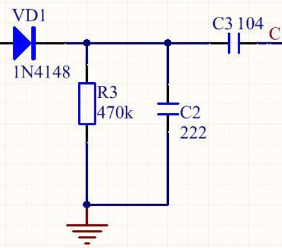
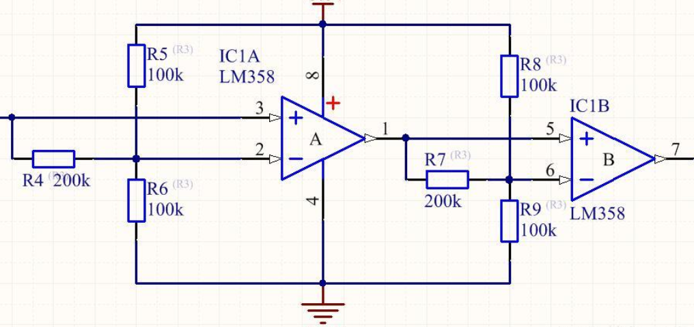
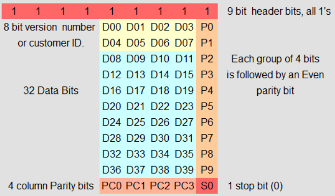

# ID卡（非接触卡）的读卡原理

## 1.简单描述

ID卡全称为身份识别卡（**Identification Card**）,是一种**不可写入**的感应卡,含**固定的编号**,主要类型有台湾SYRIS的**EM格式，**美国HID,TI,MOTOROLA等。

在出厂时，厂家会将ID号写死在芯片的内部，是不允许进行二次修改的。国内常见的型号有EM4100和EM4102。

有别于IC卡这种高频（13.56MHz）、可加密的存储卡，ID卡属于低频（**125KHz**）的只读卡。

## 2.读卡流程

1.读卡器采用射频识别技术（RFID），持续发射特定频率的射频信号

2.当ID卡进入读卡器工作范围时，将产生感应电流，将自身芯片内的编码信息通过线圈发送出去

3.读卡器接收到从ID卡发送来的调制信号，经过解调后，得到ID卡的编码信息

## 3.工作原理

**1.读卡器发送射频信号：推挽式功放电路**（放大）+**LC谐振电路**（选频）

 **+**  

**2.ID卡返回编码信息：负载调制**

**关于负载调制**：

通常使用电阻负载调制，原理图如下：

当芯片工作时，会产生由内部存储的编码信息的数据流（即0和1，也就是高低电平），数据流控制开关s的变化，从而改变右端负载的大小。当数据为1时，s接通，负载变小，品质因数会降低，**谐振回路两端电压降低**；数据为0时同理。线圈右端的电压变化，通过线圈电感耦合传递给读写器，最终改变**读写器两端电压的振幅变化，产生包络**。如下图所示：

图中a为原本信号，b为ID卡线圈的电压，c为读卡器收到的**未解调的电压信号**，而红框中包络即为解调后的信号。

**整体过程：**当ID卡靠近读卡器，谐振将能量感应到了卡内线圈上，产生电流并对电容进行充电，于是产生了使芯片工作的电源电压。芯片输出存储的数据流，通过负载调制的方式将数据发送给了读卡器。

**3.读卡器解调信号获取编码：包络检波+滤波整形**

上文中提到读卡器接收到的载波的包络即为我们想要的数据，这些数据的编码方式为**曼彻斯特码**。要获取这些数据就需要**包络检波**。

上图为包络检波部分电路，获取到载波的包络部分，但是还需要进行**滤波整形**获得平滑的直流电压（曼彻斯特码），如下图：

以上电路就是读卡器和ID卡内所需的一些电路。在最后获取到ID卡相应卡号的曼彻斯特码后，只需要对其进行解码即可获得ID卡卡号，并和后台数据对比判断能否通过验证~

## 4.曼彻斯特码

常见编码方式分为以下几种：

**1.NRZ编码**（不归零编码）：数据1和0分别用高低电平表示，当一位数据传输完后电平信号不归零。

**2.BiPhase编码**（双相编码）：每当一位数据传输后，电平跳变一次。

**3.曼彻斯特编码**：利用**信号边沿**来表示0和1，并且跳变发生在**位帧中间**，比如上升沿表示1，下降沿0。

**曼彻斯特码的编码**

设数据传输的波特率为f，则一个位的时长为1/f，半个位帧的时长为T = 1/2f。

设两个函数RisingEdge(T)和FallingEdge(T)，执行过程如下：

**RisingEdge(T)：输出低电平，等待T，输出高电平，等待T，返回；**

**FallingEdge(T)：输出高电平，等待T，输出低电平，等待T，返回。**

编码的流程如下：

**曼彻斯特码的解码**

1.获取数据流的波特率

2.同步数据流的时钟信号（区分位帧边沿和半位帧边沿）

3.根据编码原理进行解码即可

## 5.常见ID卡型号的卡号数据格式（EM4100）

EM4100可存储64bits数据，可读不可写，它的数据格式如下：

**1.**第一行，是9个“1”，这是EM4100固定的格式

**2.**D00~D03，就是第一个ID号，P0代表的是第一行的偶校验（例：0010_1/0001_1/0110_0）当D00~D03中0的个数不为偶数时，偶校验置1。P0-P9均为每行前四位的偶校验，ID号共10位

**3.**PC0~PC3为每列（P0-P9）的偶校验，（例：0000000110_0）

**4.**举个栗子：卡号为**06001259E3**，转换可得**111111111 00000 01100 00000 00000 00011 00101 01010 10010 11101 00110 01000（这一串64位就是曼彻斯特码解码后得到的数据）**

**5.**在编写程序判断卡号时，应舍弃前63位数据，只取第一次64位码中的停止位0作为开头，以0111111111作为校验开头，判断第二次64位数据中的前63位数据是否符合。同理，判断完后本次的第64位停止位0作为开头再次判断，重复三次，确认卡号正确。

**6.**卡号06001259E3，其中的第一位0为版本号，第二位6为客户号，后面8位为ID号。

**7.**若卡面有标注卡号，格式一般为**0001202659 (18,23011)。**分别为ABA码和wiegand26码。ABA码由8位ID号转换成10进制可得，共10位，少位在前补0。wiegand26码这组数据分别为8位ID号的倒数56位和倒数后四位转换成十进制组成。

# 关于IC卡

## 相比于ID卡，IC卡在目前的应用更加的广泛

**1、安全性** IC卡的安全性远大于ID卡，ID卡内的卡号读取无任何权限,易于仿制。IC卡内所记录数据的读取，写入均需相应的密码认证,甚至卡片内每个区均有不同的密码保护，全面保护数据安全，IC卡写数据的密码与读出数据的密码可设为不同，提供了良好分级管理方式，确保系统安全。

**2、可记录性** ID卡不可写入数据,其记录内容(卡号)只可由芯片生产厂一次性写入，开发商只可读出卡号加以利用，无法根据系统的实际需要制订新的号码管理制度。IC卡不仅可由授权用户读出大量数据，而且亦可由授权用户写入大量数据(如新的卡号，用户的权限，用户资料等)，IC卡所记录内容可反复擦写。

**3、存储容量** ID卡仅仅记录卡号；而IC卡(比如Philips mifare1卡)可以记录约1000个字符的内容

**4、脱机与联网运行** 由于ID卡卡内无内容，故其卡片持有者的权限，系统功能操作要完全依赖于计算机网络平台数据库的支持。 而IC卡本身已记录了大量用户相关内容(卡号，用户资料，权限，消费余额等大量信息)，完全可以脱离计算机平台运行,实现联网与脱机自动转换的运行方式，能够达到大范围使用，少布线的需求。

**5、一卡通扩展应用** ID卡由于无记录,无分区,只能依赖网络软件来处理各子系统的信息,这就大大增加对网络的依赖；如果在ID卡系统完成后,用户欲增加功能点，则需要另外布线,这不仅增加了工程施工难度,而且增加了不必要的投资.所以说,使用ID卡来做系统,难以进行系统扩展,难以实现真正的一卡通。 而IC卡存储区自身分为16个分区，每个分区有不同的密码,具有多个子系统独立管理功能，如第一分区实现门禁，第二分区实现消费,第三分区实现员工考勤等等。充分实现一卡通的目的,并且可以做到完全模块化设计，用户即使要增加功能点，也无需再布线,只需增加硬件和软件模块，这便于IC卡系统以后的随时升级扩展,实现平稳升级,减少重复投资。

**6、智能化系统的维护和运行** 比如：电脑发行了一张新的用户ID卡,就必须通过ID卡系统的网络,用人工方式将所有ID卡号一个个下载到各ID卡读卡控制器中，否则ID卡被作为无效卡而不能使用;若要更改用户权限，则需在每个ID卡控制器上输入有权限的ID卡号。 又比如：在系统投入使用后经常要新增ID卡,则每新增一张卡或修改了某一张卡片的权限,就必需在该卡可用的所有控制器上输入该卡片号码，这就增加了工作量

## 关于手机NFC功能

苹果手机仅支持apple pay，门禁、公交等功能并不支持。小米还是香嗷。

在b站看到稚晖大佬做了一个可以存储多张ic卡信息的小卡片，开源了👉[L-ink_Card](https://github.com/peng-zhihui/L-ink_Card)

以后有机会想自己实现一哈
