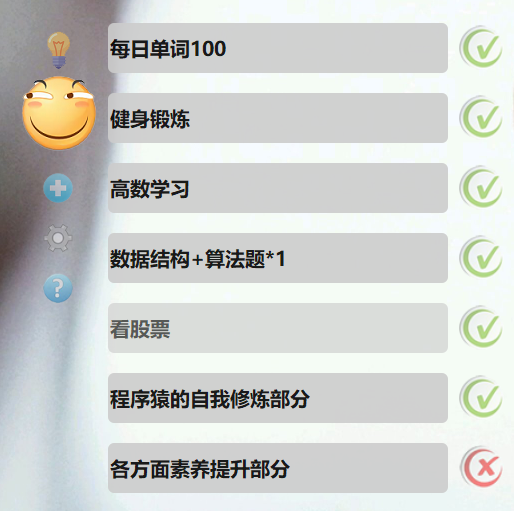
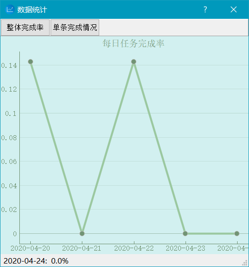
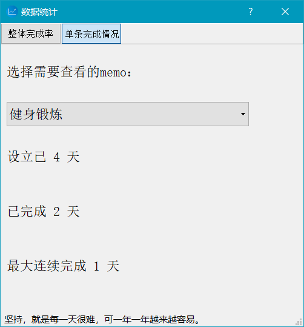

**考研党给自己制定了每日计划去执行，但是市面上的桌面便笺软件都不是很合我胃口，于是花了一个礼拜多点，完成了这款完全按照我自己心意来的桌面便笺，用起来相当舒心、顺手嘿嘿。**

国际惯例贴上源代码、以及软件下载链接~

GitHub：[memo-master](https://github.com/shen962806862/memo/)

百度网盘：[memo](https://pan.baidu.com/s/1wImGLcBkOV0c29CRr4rj5w) 提取码：61uy

### Version：1.0 【2020.4.8】

先上图~

- 主图标选择了我非常喜欢的滑稽表情~
- 灯泡是用来展开、隐藏下边菜单栏的开关~
- 菜单栏分别是新建一个便笺、设置（字体样式，便笺样式等）以及关于（软件的简单使用tips）
- 右边就是建的一个个便笺了~

**功能简介：**

1. 双击可以修改内容（目前无法使用删除键，修改方式为鼠标全选后直接输入文本，待debug）
2. 右边按钮为当日完成情况，初始化为X，点击表示完成√
3. 删除：拖动单条便笺到主图标滑稽上，松开鼠标即可删除
4. 按~键（ESC下面）即可最小化至托盘
5. 拖动主图标即可拖动整个便笺软件移动
6. 对便笺样式以及内容的修改信息均会保存，在下次启动时直接调用~
7. 主图标以及各种按钮的图标均可找自己喜欢的图片修改（要求：png图片、背景透明（怎么弄透明百度有教程，可网站上在线生成也可ps自己弄）、将处理好的图片与想改的图标做替换（文件名要相同））
8. 因为在x64系统下封装，仅适用于x64系统，linux和Windows x32目前不支持~
9. 关于里面的介绍是之前写的，忘改了，，下版再说吧，懒得重新改

**对于下版的一些想法：**

1.优化UI、以及界面控制，修复一些按键bug

2.添加时间数据，记录计划的创建、删除时间以及每天完成情况；每日0：00更新所有便笺状态为X

3.添加数据分析功能，生成统计文件。哦甚至一键生成统计图表（？这个好像有点麻烦，，得慢慢来）

4.添加一键换图标功能（仅需上传png图片）

5.想和网站做点联动，但不知道做啥==下版见

就酱~

### Version：1.1 【2020.4.24】

**1.1版本搞定！**

1.优化了设置和关于界面的UI

2.添加了主图标右键可以打开菜单栏操作功能

3.新增部分设置选项（置顶功能设置、勾选重启以创建桌面快捷方式、边缘自动隐藏功能）

4.完善了每个便笺个体的信息保存，软件在下一天启动时所有便笺状态归于未完成

5.删除了任务栏图标，只保留托盘图标了

6.更新了数据统计功能，从整体和个体角度分析完成情况

7.新增简单的一键换肤功能（不提倡，建议ps手动修图手动在img文件夹下替换）

8.关于与个人网站的联动，会做一个内测版本，将我每日的学习进度展示在我的个人网站上~暂时不打算封装起来

 

这个小项目就告一段落了~~

接下来的安排基本以考研为主了，以算法题为主要练习对象，偶尔有需求再写点脚本什么的~

### Version：1.2 【2020.6.6】

1.新增了倒计时功能，置于电脑屏幕正上方，右键为设置（内容和结束时间）、隐藏。隐藏后可在菜单栏打开。

2.新增了版本检测以及自动更新功能（有一点小bug没解决，点更新会跳cmd框并且更新时鼠标操作其他地方进度条的显示会卡死，但是不影响更新的）。更新后再次点击图标重启（重启才会删除旧版本，我没封装成正式软件，也没解决父子进程独立的问题，用的更新方法比较简单~）

3.修复了个别显示以及数据统计的小bug~

唔，越来越感觉这软件粗制滥造了hhhh，等我有空研究一下软件构造方面的知识之后再重构一遍~

### Version：2.0【2022.1.9】

没想到，这小玩意儿最后居然被我拿来当毕设了。。就挺水的==

当时为了凑毕设字数就重构了一遍代码（UI与逻辑分离之类的），但是时间比较紧，也没重构完。。所以也就没更新

现在把博客从云服务器迁到github上，才想起来这回事儿。。有空搞搞？（十有八九是没下文了）
