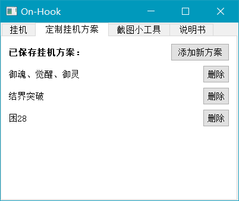
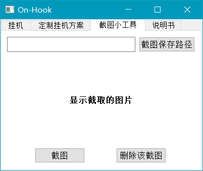
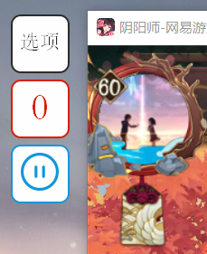
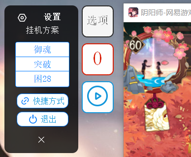
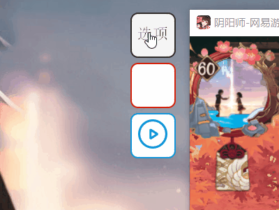

**阴阳师玩家占比最大的行为就是刷魂土了，但作为万年老咸鱼，单刷得12体，500樱饼完全挂不了多少局自动。而手动挂......既然是重复操作，就有办法用自动化脚本来代替，于是想到了最简单的模拟鼠标事件来实现。**

源码（包含2.0的GUI程序和单独的挂机python脚本）：[Github](https://github.com/shen962806862/on-hook)

百度云：[OnHook](https://pan.baidu.com/s/1cdx-o7NJC2iCyk6jyX2aCA) 提取码：mc13

### 脚本

很简单的思路——每一轮只需要两次移动和点击事件，识别到开始界面第一次移动并点击开始按钮，识别到结束界面第二次移动点击奖励界面退出去，然后循环。

为了怕被检测封号，需要对这样机械的行为进行一定**伪装**：比如一次点击事件的点击次数随机1-3次；每次点击的间隔在0.15-0.3s之间随机；每次移动的时间在0.05-0.25s随机；每次点击的像素点坐标在识别到的点击区域中随机等等。不知道有多大用，感觉是跟我个人手动挂的习惯比较相符的==

<!-- more -->

python现成的**pyautogui**库：

**click(x, y)** 函数模拟点击

**move(x, y)** 函数模拟移动

**locateOnScreen(image_path, confidence=0.8)** 函数获取指定png图片在当前屏幕状态下的左上角坐标和宽高（这里值得一提的是这个函数默认100%相同才识别，有点苛刻，需要修改参数confidence=0.8差不多。但是这个参数的使用是需要调用**cv2**这个库的，python的依赖属实==顺带吐槽一下，这个库能一下让后面封装的exe应用程序的大小扩大一倍，pyinstaller出来的exe实在太大了）。

整体代码结构，如果把一整个放到while里，按照顺序死循环识别图片，会导致响应的不够及时。而为每一类图片的识别开一个线程又太奢侈了，于是最终选择了**协程**——又称为微线程，它是实现**多任务**的另一种方式，只不过是比线程更小的执行单元（操作系统为了程序运行的高效性，每个线程都有自己缓存Cache等等数据，操作系统还会帮你做这些数据的恢复操作，所以线程的切换非常耗性能。但是协程的切换只是单纯地操作CPU的上下文，一秒钟切换上百万次都不会卡死）。

同样的，python有封装好的非常好用的三方库**gevent**：

**spawn(func, info)**  函数将生成一个协程并绑定func函数，可带输入信息；

将所有协程加入一个list中，通过 **joinall(list)** 将存储所有协程的矩阵加入协程池，并开始执行所有协程，当所有协程执行完后返回；

**sleep(time)** 将立即休眠当前线程指定时间。

最后就是组装了。将通过pyautogui库实现的识别指定位置并模拟点击行为封装成函数，在**spawn**中导入，输入为每一类的图片路径即可实现脚本功能。因为这个函数中写有while(True)，因此每个协程都不会主动停止，需等待外部指令中断运行。

**也不知道是不是还没过完以前做上位机时的瘾，，每次写个脚本都想封装成exe配个GUI界面......而我只会qt......PyQt5的封装实在太大了，用了各种方法也没能给它压缩下去==想学一下C#了......**

### version 1.0

  

经典老界面，我这审美没救了。

P1：可以选择挂机方案，输入挂机轮数（不输入就是无限挂），主窗口显示每次鼠标行为的信息，停止后返回总挂机轮数和用时。

P2：设置挂机方案，双击编辑方案名和选择该方案所需识别的截图。

P3：截图功能，仿QQ。（这里学到了PyQt一个很重要的函数**paintEvent( )**，超级有用，是实现动态效果的好帮手，帮助实现了2.0版本中不少特效）

这软件单独一个窗口，用起来不方便，也不好看，功能还四不像，跟个缝合怪似的，做完就被我放弃了。。

我老想让一个软件的功能尽可能完善，所以每次能想到的可能会用到的都加进去，就很冗余。。

于是立马着手2.0版本👇

### version2.0

         

嗯，主界面如上图所示，挂在客户端的左上角，面积很小，然后改了改UI，看上去还行哈哈。

设计的灵感来自于炉石的HDT插件（看胜率那个），也是悬挂在炉石界面的顶部，看上去轻便美观，一目了然。

**功能介绍：**

**1.第二块**

用于显示挂机成功的轮数，简洁明了~停止后再次开始就会重新计数。

**2.第三块**

是控制开始结束的按钮，主要绑定了三个事件：1.按钮图标的变化；2.挂机线程的启动/停止；3.时间统计框的弹出/落下。

1. 很简单，每次点击判断状态然后修改图标至相应状态 即可；
2. 这里要注意，挂机脚本的函数内是死循环！也就是说当协程被执行，GUI界面会处于假死状态，无法进行任何的UI交互。因此，使用**QThread**分出一个子线程用于控制挂机任务，将挂机任务的函数内容重写至**QThread**的**run( )** 函数内即可。这里还要注意，中止时不仅需要杀死这个子线程，同时也需要杀死已加入协程池的所有协程。否则鼠标事件依旧会执行。
3. 这个就是纯UI的设计了，使用了github上的方案pyqt5Custom.Toast类👉[pyqt5Custom](https://github.com/kadir014/pyqt5-custom-widgets)。

首先是一个水平布局，包含一个icon图标、文本Label和关闭按钮，设置了qss样式（黑色半透明，圆角，按钮default、press、hover等不同样式）。其次是动态升起和落下的特效，这里用到了上述的**paintEvent( ) 事件。**

这个函数不能被直接调用，而是被动触发的，触发条件为——**当窗口需要被重绘时（包含第一次显示）（这里又关联了另一个pyqt5内置函数：update( ) 用于发送窗口绘制事件）。**那么动态原理就简单了**：**

1. 通过在父子类中**相互调用彼此的update函数实现循环**，不断触发paintEvent，在其中使用**setGeometry函数**不断的调整这个框的显示位置直至达到预期的显示位置。
2. 控制窗体移动的速度变化：采用**先快后慢**的变化曲线，在视觉感官上会比较自然舒服。因此选用了在0~1之间呈现此曲线的 **y = 1 - (1-x) ^ 4** 函数。设置参数speed控制速度快慢，计算每次重绘窗体和开始移动时的时间戳之差**t**，用 **speed \* t** 作为x的输入，那么随着时间的变化，y的值会逐渐接近1直至达到。最后只需要将：**原坐标 +/- (y \* 移动距离)** 这一数据作为setGeometry的输入，就可以实现移动效果了。

   

**3.第一块**

用于打开设置选项，如上图所示。选项中包含挂机方案的选择、创建桌面快捷方式和关闭程序的按钮。

唔，弹出收回的动态效果是对上述Toast类的修改，修改了内部的布局内容和动态弹出的方向。另外在收回时的速度曲线我认为是应该跟上述的 **y = 1 - (1-x) ^ 4**  **关于y=x对称**的，即先慢后快，因此修改了曲线函数为 **y = x ^ 3**。

而GUI界面中所有按钮包括方案的分段按钮组的特效都是在paintEvent( ) 这个函数的基础上来实现的。这个函数真的非常非常的重要！

设置选项里的按钮们的颜色、背景颜色和动态效果等其实我也没想到什么更好的方案，总觉得怪怪的，但又还行。。就先这样了。

PyQt5这个库我暂时是不想再用了。。因为封装的应用程序实在是太大了。。。好蠢，而且启动速度也很慢......接下来要学C#和C++了，正好也是实验室主用的编程语言~

**不过这个GUI界面我还是比较满意的哈哈哈~就酱**

### something

今天是2022.1.9，从我加入实验室以来已经快一学期了，确实干上了C#相关的活。。。但感觉自定义UI还是Qt香就是说QAQ
