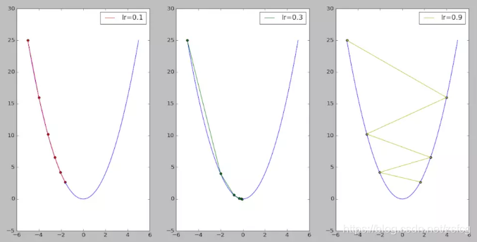
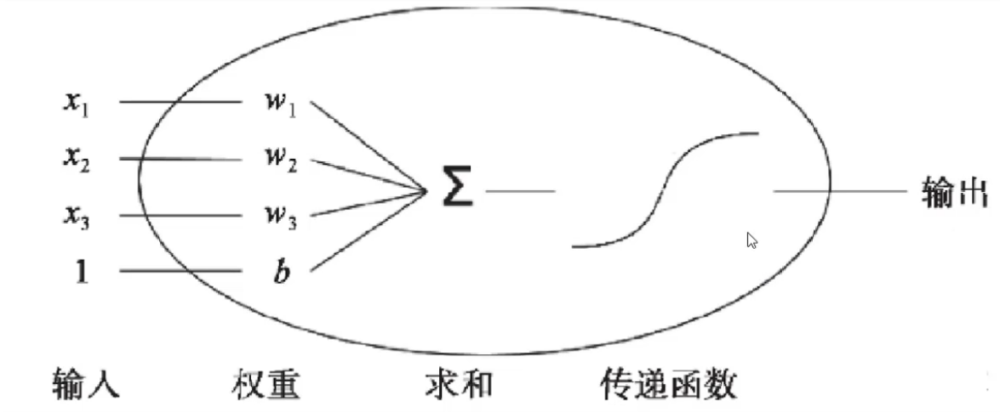
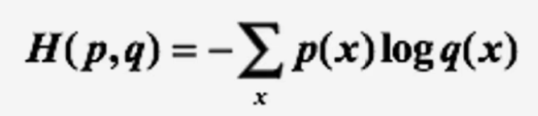
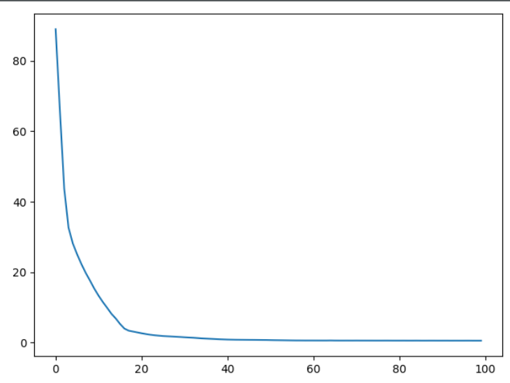
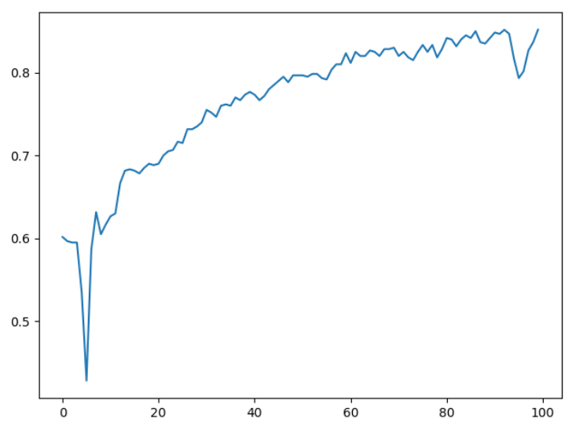

# 学习记录贴

以下所有的代码及其数据集可以去

[GitHub]: https://github.com/shen962806862/Tensorflow-Study

获取。


## 起步

### 单变量线性回归

假设：存在这么一组数据，统计了一批人的就学年限（x）和收入（y）那么两者之间可能存在如下线性关系：

**f(x) = ax + b**

我们通过f(x)这个函数映射输入特征和输出值，f(x)即为这个模型的预测值，那么机器学习的目标就是让f(x)与真实值y之间的整体误差达到最小。

<!-- more -->

#### 损失函数

通过定义**损失函数**来判断误差的大小：

可以使用均方差作为成本函数，也就是 **(f(x) - y)^2** 

那么求解问题就转化为了：**找到合适的a和b，使得损失函数越小，那么预测值整体就越准。**


#### tf函数

```python
model = tf.keras.Sequential()
```

创建一个序列化模型

```python
model.add(tf.keras.layers.Dense(1))
```

添加一个图层

```python
tf.keras.layers.Dense(1)
```

生成全连接网络层

参数：

**inputs**：必需，即需要进行操作的输入数据。
**units**：必须，即神经元的数量。
**activation**：可选，默认为 None，如果为 None 则是线性激活。
**use_bias**：可选，默认为 True，是否使用偏置。
**kernel_initializer**：可选，默认为 None，即权重的初始化方法，如果为 None，则使用默认的 Xavier 初始化方法。
**bias_initializer**：可选，默认为零值初始化，即偏置的初始化方法。
**kernel_regularizer**：可选，默认为 None，施加在权重上的正则项。
**bias_regularizer**：可选，默认为 None，施加在偏置上的正则项。
**activity_regularizer**：可选，默认为 None，施加在输出上的正则项。
**kernel_constraint**，可选，默认为 None，施加在权重上的约束项。
**bias_constraint**，可选，默认为 None，施加在偏置上的约束项。
**trainable**：可选，默认为 True，布尔类型，如果为 True，则将变量添加到 GraphKeys.TRAINABLE_VARIABLES 中。
**name**：可选，默认为 None，卷积层的名称。
**reuse**：可选，默认为 None，布尔类型，如果为 True，那么如果 name 相同时，会重复利用。
**返回**值： 全连接网络处理后的 Tensor。

```python
model.summary()
```

获取Sequential模型的信息。

```python
model.compile(optimizer='adam', loss='mse')
```

模型的编译。

```python
history = model.fit(x, y, epochs=5000)
```

模型的训练（x，y为训练数据，epochs为训练轮数）

```python
predict = model.predict(x)
```

模型的预测（x为要预测的测试输入）


#### e.g - keras实现单变量线性回归

```python
import tensorflow as tf
import pandas as pd
import numpy as np

# 读取csv信息
data = pd.read_csv("../dataset/income.csv")
x = data.Education
y = data.Income

# 创建Sequential模型（空）
model = tf.keras.Sequential()
# 添加层数 Dense为全连接层
model.add(tf.keras.layers.Dense(1))
# 获取模型的信息
# model.summary()
# 模型的编译
# adam为优化方法，mse为均方差
model.compile(optimizer='adam', loss='mse')

history = model.fit(x, y, epochs=5000)
predict = model.predict(x)
for i in range(np.shape(predict)[0]):
    print(predict[i][0], y[i])
```

数据集为上文中提到的就学年限和收入之间的关系。最后结果如下：

```python
1/1 [==============================] - 0s 0s/step - loss: 2657.5540
Epoch 2/5000
1/1 [==============================] - 0s 0s/step - loss: 2655.8018
    ······
Epoch 2463/5000
1/1 [==============================] - 0s 0s/step - loss: 371.0563
Epoch 2464/5000
1/1 [==============================] - 0s 0s/step - loss: 370.7202
    ······
Epoch 4999/5000
1/1 [==============================] - 0s 1000us/step - loss: 112.1488
Epoch 5000/5000
1/1 [==============================] - 0s 0s/step - loss: 112.1450
    
32.786636 26.658839
34.000195 27.306435
35.335106 22.13241
36.548668 21.169841
······
62.761528 76.098135
66.5538   77.355021
67.858475 72.11879
69.07204  80.260571
```

预测结果非常滴不准哈哈哈。


### 梯度下降算法

主要目的：**通过迭代找到目标函数的最小值，或者收敛到最小值。**


#### 基本思想

梯度下降法的基本思想可以类比为一个下山的过程：

假设这样一个场景：一个人被困在山上，需要从山上下来(找到山的最低点，也就是山谷)。但此时山上的浓雾很大，导致可视度很低；因此，下山的路径就无法确定，必须利用自己周围的信息一步一步地找到下山的路。这个时候，便可利用梯度下降算法来帮助自己下山。怎么做呢，首先以他当前的所处的位置为基准，寻找这个位置最陡峭的地方，然后朝着下降方向走一步，然后又继续以当前位置为基准，再找最陡峭的地方，再走直到最后到达最低处。

梯度下降法的基本过程也是如此：

首先，我们有一个可微分的函数。这个函数就代表着一座山。我们的目标就是找到这个函数的最小值，也就是山底。根据之前的场景假设，最快的下山的方式就是找到当前位置最陡峭的方向，然后沿着此方向向下走；对应到函数中，就是**找到给定点的梯度 ，然后朝着梯度相反的方向**，就能让函数值下降的最快。因为**梯度的方向就是函数值上升最快的方向。**所以，我们重复利用这个方法，反复求取梯度，最后就能到达**局部的最小值**。


#### 学习率

场景同上，一个人在一步步下山的过程中，他的步长，就是学习率。

相同的，在函数中，就是迭代的步长。

假设待优化函数为f(x), dx为函数对变量x的导数，即下降方向，α为学习率。每次x的迭代公式为：
$$
x = x - α * dx
$$
而学习率不能太大也不能太小。**太小会导致收敛过慢，太大会导致震荡。**



从上图还可得知，随着迭代过程的继续，学习率应当适当减小，这样才能更稳妥地到达极值点。这种想法就是通过**权重衰减因子**实现的。

```python
α_i = α_start * 1.0 / (1.0 + decay * i)
x = x - α_i * dx
```

其中i为迭代周期（epochs），decay为衰减因子，取值范围[0,1]。


#### 冲量

随着迭代的进行，学习率α慢慢减小，后期的迭代过程会非常缓慢。而冲量可以较好地解决这一问题。冲量的理念来源于物理过程。例如，快速行驶的汽车即使踩死刹车，车也不会立刻停下，仍然会向前行驶一段距离，这是因为前一时刻车速依然不为0导致的。换言之，前一刻车的运行状态对此刻是有影响的。因此，**可以在迭代过程中，考虑前一次迭代对本次迭代的影响。**

```python
α_i = α_start * 1.0 / (1.0 + decay * i)
x = x - α_i * dx - α_i * predx * momentum
predx = dx
```

其中**predx为上一次迭代的梯度，momentum为冲量，取值[0, 1]**


以上计算只能找到**局部最小**，那如何找到函数的最小值呢？

神经网络在计算前会先随机选定n个点，对每个点进行梯度下降算法，分别寻找局部最优，那么总会有一个点的局部最优，为全局最优解，最终找到最小值。


### 多层感知器

**单个神经元（二分类）**



**多个神经元（多分类）**


以上均为单层神经元，它存在一个缺陷：**无法拟合异或运算**

因为神经元要求数据必须是线性可分的，而异或问题无法找到一条直线分割两个类。

**多层感知器**


即在输入和输出层之间插入更多的层数，更多层的神经元。**多层感知器的层与层之间是全连接的。**


#### 激活函数

**为什么要使用激活函数？**

1.不使用激活函数，每层输出都是上层输入的线性函数，无论网络有多少层，输出都是输入的线性组合。

2.使用激活函数，能够给神经元引入非线性因素，使得神经网络可以任意逼近任何非线性函数，这样神经网络就可以利用到更多的非线性模型中。


**激活函数的特质：**

1.连续并可导（允许少数点上不可导）的非线性函数。可导的激活函数可以直接利用数值优化的方法来学习网络参数

2.激活函数及其导函数要尽可能的简单，有利于提高网络计算效率

3.激活函数的导函数的值域要在一个合适的区间内，不能太大也不能太小，否则会影响训练的效率和稳定性


**常用激活函数**

**1.relu**


**2.sigmoid**


**3.tanh**


#### e.g - keras实现多层感知器

```python
import tensorflow as tf
import pandas as pd
import numpy as np

# 读取csv信息
data = pd.read_csv("../dataset/advertising.csv")
# iloc[,]获取行列数据，此处x为第一列到最后一列（不包含）的所有行
x = data.iloc[20:, 1:-1]
y = data.iloc[20:, -1]
# 将数据集分割为训练集和测试集
test = data.iloc[:20, 1:-1]
test_rst = data.iloc[:20, -1]

# 创建Sequential模型
model = tf.keras.Sequential(
    [tf.keras.Input(3,),        # 输入层
     tf.keras.layers.Dense(10, activation='relu'),  # 隐藏层（10个神经元）
     tf.keras.layers.Dense(1)]  # 输出层
)
# 获取模型的信息
# model.summary()
# 模型的编译和训练
model.compile(optimizer='adam', loss='mse')
history = model.fit(x, y, epochs=100)
# 预测
predict = model.predict(test)
for i in range(np.shape(predict)[0]):
    print(predict[i][0], test_rst[i])
```

使用的advertising数据集记录了在TV、radio、newspaper各自的投入及相应的销售情况。


最终结果如下：

```python
Epoch 1/100
6/6 [==============================] - 0s 488us/step - loss: 2093.9897
Epoch 2/100
6/6 [==============================] - 0s 400us/step - loss: 1704.1735
	······
Epoch 14/100
6/6 [==============================] - 0s 165us/step - loss: 47.1523
Epoch 15/100
6/6 [==============================] - 0s 165us/step - loss: 35.5529
    ······
Epoch 99/100
6/6 [==============================] - 0s 165us/step - loss: 3.3431
Epoch 100/100
6/6 [==============================] - 0s 341us/step - loss: 3.3322

# 数据对比
22.801159 22.1
10.063064 10.4
10.031083 9.3
20.032402 18.5
	······
13.104331 12.5
25.333363 24.4
9.60645   11.3
14.094693 14.6
```


### 逻辑回归

线性回归，预测的是**连续的值**

逻辑回归，预测的是**是与否**

逻辑回归虽然叫“回归”，但实际上它是一种分类方法，主要用于两分类问题（即输出只有两种，分别代表两个类别），所以利用了Sigmoid函数作为激活函数。


#### 损失函数

线性回归中使用的均方差，实际惩罚的是输出与损失为同一数量级的情形，这对逻辑回归的0-1并不适用。

对于分类问题，使用 **交叉熵损失函数** 会更有效，输出的损失值更大。

交叉嫡刻画的是**实际输出（概率）与期望输出 (概率) 的距离**，也就是**交叉嫡的值越小，两个概率分布就越接近。**假设概率分布**p**为期望输出，概率分布**q**为实际输出，**H(p,q)**为交叉嫡，则:




#### e.g - keras实现逻辑回归

```python
import tensorflow as tf
import pandas as pd
import matplotlib.pyplot as plt

# 读取csv信息
data = pd.read_csv("../dataset/credit-a.csv", header=None)
# iloc[,]获取行列数据，此处x为第一列到最后一列（不包含）的所有行
x = data.iloc[53:, :-1]
y = data.iloc[53:, -1].replace(-1, 0)
# 将数据集分割为训练集和测试集
test = data.iloc[:53, :-1]
test_rst = data.iloc[:53, -1].replace(-1, 0)

# 创建Sequential模型
model = tf.keras.Sequential(
    [tf.keras.Input(15,),        # 输入层
     tf.keras.layers.Dense(4, activation='relu'),  # 隐藏层（4个神经元）
     tf.keras.layers.Dense(4, activation='relu'),  # 隐藏层（4个神经元）
     tf.keras.layers.Dense(1, activation='sigmoid')]  # 输出层
)
# 获取模型的信息
# model.summary()
# 模型的编译和训练
model.compile(optimizer='adam', loss='binary_crossentropy', metrics=['acc'])
history = model.fit(x, y, epochs=100)
# 预测
predict = model.predict(test)

# plt.plot(history.epoch, history.history.get('loss'))
plt.plot(history.epoch, history.history.get('acc'))
plt.show()
```

训练结果如下：

```python
Epoch 1/100
19/19 [==============================] - 0s 412us/step - loss: 116.4543 - acc: 0.6017
Epoch 2/100
19/19 [==============================] - 0s 386us/step - loss: 94.4256 - acc: 0.5967
	······
Epoch 99/100
19/19 [==============================] - 0s 372us/step - loss: 0.3965 - acc: 0.8367
Epoch 100/100
19/19 [==============================] - 0s 403us/step - loss: 0.3923 - acc: 0.8517
```

**epoch与loss曲线**



**epoch与acc曲线**



### softmax多分类

