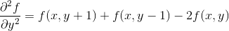
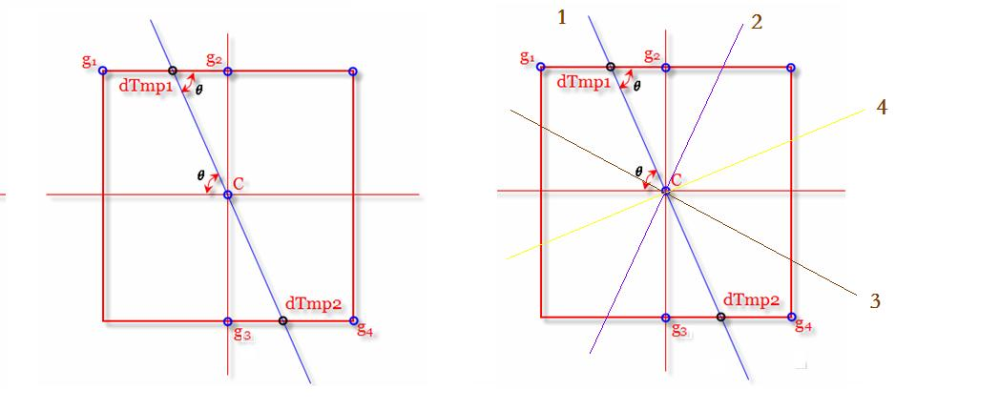
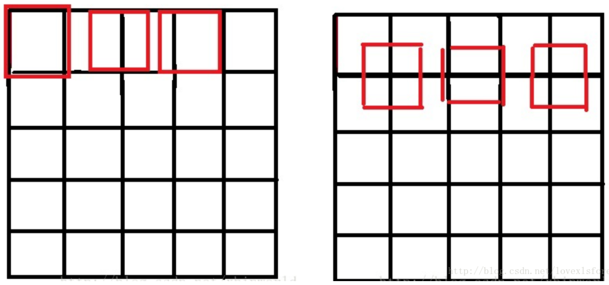
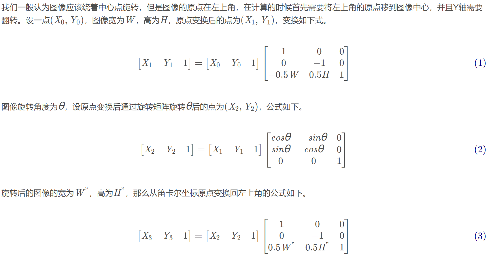
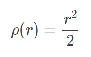

# 图像

## 低通滤波

### 邻域滤波


### 中值滤波

图像的中值滤波是一种非线性图像处理方法,是统计排序滤波器的一种典型应用。中值滤波是通过**对邻域内像素按灰度排序的结果**决定**中心像素**的灰度。具体的操作过程如下：<font color="red">用一个奇数点的移动窗口，将窗口中心点的值用窗口内各点的中值代替。</font>假设窗口内有5个点，其值为1,2,3,4和5，那么此窗口内各点的中值即为3，也就是用3来代替中心点的像素值。

中值滤波对于滤除**脉冲干扰及图像扫描噪声**最为有效，还可以克服线性滤波器（如领域简单平滑滤波）带来的图像细节模糊。

数字图像存在冗余信息，具体分为六大冗余：空间冗余、时间冗余、视觉冗余、信息熵冗余、结构冗余、知识冗余。其中第一个空间冗余就可以很好的解释中值滤波的作用。空间冗余指的是：图像内部**相邻像素之间存在较强的相关性而造成的冗余**。简单来说就是，同一景物表面上采样点的颜色之间通常存在着空间相关性，相邻各点的取值往往相近或者相同，这就是空间冗余。而脉冲噪声通常是在一个邻域内有一个点或多个点的灰度值很高或很低，这就与周围像素存在较大差异，因此中值滤波能很好的去除这种噪声。

需要注意的是，中值滤波的**窗口形状和尺寸**对滤波效果影响很大，不同的图像内容和不同的应用要求，往往采用不同的窗口形状和尺寸。常用的中值滤波窗口有线状、方形、圆形、十字形以及圆环形等等。窗口尺寸一般先用3x3,再取5x5逐渐增大，直到滤波效果满意为止。就一般经验来讲，对于有缓变的较长轮廓线物体的图像，采用方形或圆形窗口为宜。对于包含有尖顶物体的图像，用十字形窗口，而窗口大小则以不超过图像中最小有效物体的尺寸为宜。如果图像中点、线、尖角细节较多（感觉就是邻域灰度值变化较大），则不宜采用中值滤波。


### 自适应中值滤波

上面提到常规的中值滤波器，在噪声的**密度不是很大**的情况下，效果不错。但是密度较高时，常规的中值滤波的效果就不是很好了。有一个选择就是增大滤波器的窗口大小，这虽然在一定程度上能解决上述的问题，但是会给图像造成较大的模糊。

常规的中值滤波器的窗口尺寸是固定大小不变的，就**不能同时兼顾去噪和保护图像的细节**。这时就要寻求一种改变，根据预先设定好的条件，在滤波的过程中，**动态的改变滤波器的窗口尺寸大小**，这就是自适应中值滤波器 。在滤波的过程中，自适应中值滤波器会根据预先设定好的条件，改变滤波窗口的尺寸大小，同时还会根据一定的条件判断当前像素是不是噪声，如果是则用**邻域中值**替换掉当前像素；不是，则不作改变。

自适应中值滤波器有三个**目的**：

- 滤除椒盐噪声
- 平滑其他非脉冲噪声
- 尽可能的保护图像中细节信息，避免图像边缘的细化或者粗化。

**实现过程：**

对于每一个像素点的处理，使用一个while循环。在while循环中：

首先，在当前像素点下根据当前尺寸窗口的大小获取数据存入数组；

其次，获取窗口内像素的最大最小值和中值；

再，得到A1（中值 - 最小值），A2（中值 - 最大值）。

预先定义好以下符号：

Sxy：		滤波器的作用区域，滤波器窗口所覆盖的区域；
Zmin：	Sxy中最小的灰度值；
Zmax：	Sxy中最大的灰度值；
Zmed：	Sxy中所有灰度值的中值；
Zxy：		表示图像中对应像素点的灰度值；
Smax：	Sxy所允许的最大窗口尺寸；

自适应中值滤波器分为以下两个过程，A和B：

A:

1. A1 = Zmed - Zmin
2. A2 = Zmed - Zmax
3. 如果A1>0 且 A2<0，则跳转到B
4. 否则，增大窗口的尺寸
5. 如果增大后的尺寸 ≤ Smax，则重复A
6. 否则，直接输出Zmed

B：

1. B1 = Zxy - Zmin
2. B2 = Zxy - Zmax
3. 如果B1>0 且 B2<0，则输出Zxy
4. 否则输出Zmed

**实现原理：**

**A**步骤实质是判断当前区域的中值点是否是噪声点，通常来说是满足条件的，此时中值点不是噪声点，跳转到**B**；考虑一些特殊情况，如果Zmed=Zmin或者Zmed=Zmax，则认为是噪声点，应该扩大窗口尺寸，在一个更大的范围内寻找一个合适的非噪声点，随后再跳转到**B**，否则输出的中值点是噪声点；

接下来考虑跳转到**B**之后的情况：判断中心点的像素值是否是噪声点，原理同上，因为如果Zxy=Zmin或者Zxy=Zmax，则认为是噪声点。如果不是噪声点，我们可以保留当前像素点的灰度值；如果是噪声点，则使用中值替代原始灰度值，滤去噪声。


### 均值滤波

一种特殊形式的邻域滤波（邻域算子都是1/M*N）。

图片中一个方块区域（一般为3*3）内，中心点的像素为全部点像素值的平均值。均值滤波就是对于整张图片进行以上操作。

**缺陷**：均值滤波本身存在着固有的缺陷，即它不能很好地保护图像细节，在图像去噪的同时也破坏了图像的细节部分，从而使**图像变得模糊，不能很好地去除噪声点**。特别是椒盐噪声

#### 算术均值滤波

这是**最简单的均值滤波器，可以去除均匀噪声和高斯噪声，但会对图像造成一定程度的模糊**。

算术均值滤波器就是简单的计算窗口区域的像素均值，然后将均值赋值给窗口中心点处的像素：


其中，g(s,t)表示原始图像，f(x,y)表示均值滤波后得到的图像，Sxy表示滤波器窗口。

基于上述公式，可以很容易的得到的算术均值滤波器的窗口模板，下面以3×3为例：


#### 几何均值滤波

滤波后图像的像素由模板窗口内像素的乘积的1/mn幂给出。 和算术均值滤波器相比，几何均值滤波器能够**更好的取出高斯噪声，并且能够更多的保留图像的边缘信息**。但其**对0值是非常敏感**的，在滤波器的窗口内只要有一个像素的灰度值为0，就会造成滤波器的输出结果为0。

公式如下：


#### 谐波均值滤波

**对盐粒噪声（白噪声）效果较好，不适用于胡椒噪声；比较适合处理高斯噪声。**

公式如下：


#### 逆谐波均值滤波


其中Q称为滤波器的阶数，该滤波器可以用来**消除椒盐噪声**。但是不能同时处理盐粒噪声和胡椒噪声，当Q为正时，可以消除**胡椒噪声**；当Q为负时，消除**盐粒噪声**。当Q=0时，该滤波器退化为算术均值滤波器；Q=-1时，退化为谐波均值滤波器。


#### 修正后的alpha均值滤波

假设在Sxy模板领域内，去掉g(s,t)中最高灰度值的d/2和最低灰度值的d/2个像素。用gr(s,t)来代替剩余的mn-d个像素。由剩余像素点的平均值形成的滤波器称为修正后的alpha均值滤波器：


其中d取0~m*n-1之间的任意数。

当d=0时，退变为算术均值滤波；

当d=(m*n-1)，退变为中值滤波器；

d取其他值时，该滤波器适用于包括多种噪声的情况，如高斯噪声和椒盐噪声混合的情况。


### 最值滤波

#### 最大值和最小值滤波

最值滤波就是取kernal排序后得最大值或最小值来取代中心像素作为输出。

分为最大值滤波和最小值滤波，分别相当于形态学操作的**膨胀和腐蚀**。


#### 中点滤波

在上述最值滤波的基础上，取最大值和最小值的平均值作为中心像素点的输出。


### 双边滤波

双边滤波是一种非线性滤波器，它可以达到保持边缘、降噪平滑的效果。和其他滤波原理一样，双边滤波也是采用加权平均的方法，用周边像素亮度值的加权平均代表某个像素的强度，所用的加权平均基于高斯分布[1]。最重要的是，双边滤波的权重不仅考虑了像素的**欧氏距离**（如普通的高斯低通滤波，只考虑了位置对中心像素的影响），还考虑了像素范围域中的**辐射差异**（例如卷积核中像素与中心像素之间相似程度、颜色强度，深度距离等），在计算中心像素的时候同时考虑这两个权重。它是一种可以保边去噪的滤波器。之所以可以达到此去噪效果，是因为滤波器是由两个函数构成。一个函数是由**几何空间距离**决定滤波器系数。另一个由**像素差值**决定滤波器系数。

双边滤波的核函数是空间域核与像素范围域核的综合结果：**在图像的平坦区域，像素值变化很小，对应的像素范围域权重接近于1，此时空间域权重起主要作用，相当于进行高斯模糊；在图像的边缘区域，像素值变化很大，像素范围域权重变大，从而保持了边缘的信息。**

**空间域**公式如下：


**像素范围**域（颜色域）公式如下：


他们的乘积即为双边滤波的权重：


根据权重计算最后目标点的像素值：


### 高斯滤波

高斯滤波器是一种线性滤波器，能够有效的抑制噪声，平滑图像。其作用原理和均值滤波器类似，都是取滤波器窗口内的像素的均值作为输出。其窗口模板的系数和均值滤波器不同，均值滤波器的模板系数都是相同的为1；而高斯滤波器的**模板系数，则随着距离模板中心的增大而系数减小**。所以，高斯滤波器相比于均值滤波器对图像个**模糊程度较小**。

**高斯滤波器**

二维高斯函数如下：


其中e前的参数可以忽略，因为这只是个表示幅值的常数，并不影响相互之间的比例关系，并且最终都要进行归一化，所以实际只需要计算后半部分即可。该参数仅影响图像的亮度而不影响模糊。

例如，要产生一个3×3的高斯滤波器模板，以模板的中心位置为坐标原点进行取样。模板在各个位置的坐标，如下所示（x轴水平向右，y轴竖直向下）


对于窗口模板的大小为 (2k+1)×(2k+1)，模板中各个元素值的计算公式如下：


转化为代码：

```cpp
for(int i = 0; i < m; ++i)
    for(int j = 0; j < n; ++j)
        double g = exp(((i - m/2)*(i - m/2) + (j - n/2)*(j - n/2)) * -1.0 / (2 * sigma * sigma));
```

再对求出来的每个g进行归一化（因为求的是加权平均，要保证窗口模板各元素和为1）

```cpp
kernel = g / sum;
```

关于高斯分布的**标准差σ的选值**，代表着数据的离散程度。如果σ较小，那么生成的模板的中心系数较大，而周围的系数较小，这样对图像的平滑效果就不是很明显；反之，σ较大，则生成的模板的各个系数相差就不是很大，比较类似均值模板，对图像的平滑效果比较明显。

高斯分布的概率分布密度图如下：


横轴表示可能得取值x，竖轴表示概率分布密度F(x)，那么不难理解这样一个曲线与x轴围成的图形面积为1。σσ（标准差）决定了这个图形的宽度，可以得出这样的结论：σσ越大，则图形越宽，尖峰越小，图形较为平缓；σσ越小，则图形越窄，越集中，中间部分也就越尖，图形变化比较剧烈。这其实很好理解，如果sigma也就是标准差越大，则表示该密度分布一定比较分散，由于面积为1，于是尖峰部分减小，宽度越宽（分布越分散）；同理，当σσ越小时，说明密度分布较为集中，于是尖峰越尖，宽度越窄！

以上求出来的就是模板系数，滤波操作就是分别以图像的每个像素点为中心再根据模板系数求出加权平均像素，作为该点的滤波后像素。比如3x3模板，对选中像素点的外一圈共九个像素点，分别乘以对应位置的模板系数再求和，即为选中点的像素。


## 高通滤波（边缘检测）

如何识别图像边缘？图里面有一条线,左边很亮,右边很暗,那人眼就很容易识别这条线作为边缘.也就是**像素的灰度值快速变化的地方**，那么如何来数学化这个问题，就是**梯度。**

1. 要获得一幅图像的梯度，就需要在图像的每个像素点计算对x和对y的偏导数，也就是 **gx = f(x+1,y) - f(x,y) 和 gy = f(x,y+1) - f(x,y)**，转化为模板也就是，水平和垂直的 **[-1,1]** 模板。
2. 而当我们对对角线方向的边缘感兴趣时，就产生了**Roberts算子**，原理就是把一维的模板斜过来。
3. Roberts算子中2x2的模板在概念上很简单，但在实际应用中，它对于用关于中心点对称的模板来计算边缘方向不是很有用。相对来说3x3考虑了中心点对端数据的性质，并携带了关于边缘方向的更多信息。于是就产生了 **Prewitt算子**。它的3x3模板考虑到了水平/垂直和斜边的信息，相比于Roberts更准确。
4. 在Prewitt的基础上，在卷积核的中心位置处使用2代替1，**能较为有效的平滑图像，抑制噪声**，这就是**Sobel算子**。而针对不同的需求，可以设计不同的卷积核，例如需要对对角线方向有更好的响应，那么可以将2设置在卷积核的两个对角。


### Roberts算子

Roberts算子是一种最简单的算子，利用**局部差分**寻找边缘的算子。采用对角线相邻两像素之差近似梯度幅值检测边缘。检测**垂直边缘的效果比斜向边缘要好**，定位精度高，对噪声比较敏感，无法抑制噪声的影响。

Roberts边缘算子是一个2x2的模板，采用的是对角方向相邻的两个像素之差。从图像处理的实际效果来看，边缘定位较准，对噪声敏感。模板如下：


对于输入图像f(x,y),使用Roberts算子后输出的目标图像为g(x,y),则


### Sobel算子（一阶导数法）

**基于寻找梯度强度**


对于f(t),其导数f'(t)反映了每一处的变化趋势.在变化最快的位置其导数最大. sobel算子的思路就是模拟求一阶导数.

sobel算子是一个离散差分算子.它计算图像像素点亮度值的近似梯度。图像是二维的,即沿着宽度/高度两个方向。我们使用两个卷积核对原图像进行处理:

水平方向：


原始像素灰度值-->(右边像素值-左边像素值),反映了水平方向的变化情况.

垂直方向同理：


这样就得到了两个新的矩阵,分别反映了每一点像素在水平方向上的亮度变化情况和在垂直方向上的亮度变换情况。

综合考虑这两个方向的变化，使用反映某个像素的梯度变化情况.

有时候为了简单起见,也直接用绝对值相加替代：

在opencv中也可以通过以下卷积核（Scharr）大像素的变化情况：


与滤波一样，对每个像素点的处理为：要操作像素点对应于Gx，Gy矩阵中心，对该像素点和周边9个像素点乘以相应系数求和，得到一个方向上的处理结果。完整的Sobel算子则需要对两个方向上的处理结果求和，得到完整的新像素值。


### Prewitt算子

Prewitt算子的原理和sobel是一模一样的，唯一的区别就是卷积核存在差异：


Sobel相较于Prewitt，**在中心权值上使用2来代替1，这样可以较好的抑制噪声。**


### Laplacian算子（二阶微分法）

**基于过零点检测**

对Sobel算子中的一阶导数函数再次求导可得：


二阶差分公式：

Laplace算子的差分形式：

分别对Laplace算子x,y两个方向的二阶导数进行差分就得到了离散函数的Laplace算子。在一个二维函数f(x,y)中，x,y两个方向的二阶差分分别为：


于是可得Laplace算子的差分形式为：



写作滤波模板的形式如下：


注意该模板的特点，在上下左右四个90度的方向上结果相同，也就是说在90度方向上无方向性。为了让该mask在45度的方向上也具有该性质，可以对该模板进行扩展定义为：


注：定义数字形式的拉普拉斯要求系数之和必为0。

之后的操作与其他的空间滤波操作相同。将模板在原图上逐行移动，然后模板中各系数与其重合的像素相乘后求和，赋给与mask中心重合的像素。

**拉普拉斯对噪声敏感，会产生双边效果。不能检测出边的方向。通常不直接用于边的检测，只起辅助的角色，检测一个像素是在边的亮的一边还是暗的一边利用零跨越，确定边的位置。**


### Canny算子

图像边缘信息主要集中在高频段，通常说图像锐化或检测边缘，实质就是高频滤波。

微分运算是求信号的变化率，具有加强高频分量的作用。在空域运算中来说，对图像的锐化就是计算微分。由于数字图像的离散信号，微分运算就变成计算差分或梯度。

因此canny算子求边缘点分为以下四步：

**1.使用高斯滤波器平滑图像**

卷积的核心意义就是获取原始图像中像模板特征的性质。

**2.用一阶偏导有限差分（Sobel）计算梯度值和方向**

经典Canny算法用了四个梯度算子来分别计算水平，垂直和对角线方向的梯度。但是通常都不用四个梯度算子来分别计算四个方向。常用的边缘差分算子（如Rober，Prewitt，Sobel）计算水平和垂直方向的差分Gx和Gy。这样就可以如下计算梯度模和方向：


梯度角度θ范围从弧度-π到π，然后把它近似到四个方向，分别代表水平，垂直和两个对角线方向（0°,45°,90°,135°）。

由于图像的坐标系是以左上角为原点向右和下延展，因此根据像素点计算出的角度值必然在一、四象限。那么可以分别以 ± π / 8（水平） 、π / 8 ~ 3π / 8（45°）、- π / 8 ~ - 3π / 8（-45°）、一四象限剩余部分（垂直）来分割，落在每个区域的梯度角给一个特定值，代表四个方向之一。

**3.对梯度幅值进行非极大值抑制**

意义就是寻找像素点局部最大值。

沿着梯度方向，比较它前面和后面的梯度值即可（对于左右边界，则比较附近的两个值）。如果是最大值就保留，否则置为0。



如上图，c点为需要判断的点，按照2中划分的四个区域，可以看到每个区域包含了八邻域中的两个点，通过判断c点的角度值所在区域，与该区域包含的那两个点进行比较即可。

若想提高精度，如上右图：c的角度值在π / 8 ~ 3π / 8（45°）区域，不比较g1和g4，而是比较dTmp1和dTmp2，由于这两个点都是浮点坐标，因此需要采用线性插值方法来计算这两个点的幅值。

通过角度θ可以计算出dTmp1在g1和g2之间的比例，设dis(dTmp1，g2) = w，则dis(g1，dTmp1) = 1 - w。所以dTmp1的幅值为：w * g2 + （1 - w）* g1。同理可得dTmp2的幅值。将c的幅值与这两个浮点坐标的幅值进行比较进行非极大值抑制。

**4.用双阈值算法检测、连接边缘**

一般的边缘检测算法用一个阈值来滤除噪声或颜色变化引起的小的梯度值，而保留大的梯度值。Canny算法应用双阈值，即一个高阈值和一个低阈值来区分边缘像素。如果边缘像素点梯度值大于高阈值，则被认为是强边缘点。如果边缘梯度值小于高阈值，大于低阈值，则标记为弱边缘点。小于低阈值的点则被抑制掉。

**4.5.滞后边界跟踪**

强边缘点可以认为是真的边缘。弱边缘点则可能是真的边缘，也可能是噪声或颜色变化引起的。为得到精确的结果，后者引起的弱边缘点应该去掉。通常认为**真实边缘引起的弱边缘点和强边缘点是连通的**，而又噪声引起的弱边缘点则不会。所谓的滞后边界跟踪算法**检查一个弱边缘点的8连通领域像素**，只要有强边缘点存在，那么这个弱边缘点被认为是真是边缘保留下来。

只需对所有被标记过的弱边缘点的八邻域进行遍历，若邻域中存在强边缘点，则保留；否则抑制掉。


### 方向算子

方向算子利用一组模板分别计算在不同方向上的差分值，取其中最大的值作为边缘强度，而将与之对应的方向作为边缘方向。

#### Kirsch算子

类似于Sobel算子，也利用图像中某点的梯度幅值作为像素的灰度值，Sobel算子计算出某点两个方向的梯度值，Gx、Gy；但Kirsch算子 利用8个卷积模板计算出了**某点8个方向的梯度幅值和方向**，并以最大的卷积值作为该点的灰度值。


对每个像素点都用 这8个模板进行进行卷积（注意，每个卷积值都应取绝对值），求出该点的最大卷积值。


#### Nevitia算子


## 霍夫变换

### 直线检测

#### 标准霍夫变换

首先该检测算法的输入图像只能是边缘二值图像。

**1.一条直线在图像二维空间可由两个变量表示：**

· 在笛卡尔坐标系：**y = kx + b**，可由k、b表示。

· 在极坐标系：**ρ = xcosθ + ysinθ**，可由ρ、θ表示

**2.对于点（x0，y0），可将经过这个点的一簇直线定义为ρ = x0cosθ + y0sinθ**

**2.很自然的，对于两个点，满足同一对（ρ，θ）时，这两个点处于同一直线上**

**3.于是，当有更多个点满足同一对（ρ，θ）时，该对表示的直线由更多的点组成.。一般可以通过设置直线上点的阈值来定义多少个点组成的（ρ，θ）能被认为是一条直线。**

**4.霍夫变换追踪图像中每个点对应的所有（ρ，θ）并记录数量，若超过了阈值, 那么可以认为这个交点所代表的参数对在原图像中为一条直线。**

**代码实现**

对于图像的每个像素点，遍历 [0, PI] 共180个θ值，得到相应的ρ，并对每一组（ρ，θ）记录值+1（计分板）。

遍历计分板，找出分数大于设定阈值的（ρ，θ）对，即为检测到的直线参数，再将其还原为数学概念上的直线即可。

#### 累计概率霍夫变换（常用）

它是对标准霍夫变换的改进。在一定的范围内进行霍夫变换，计算单独线段的方向以及范围，从而减少计算量，缩短计算时间。之所以称PPHT为“概率”的，是因为并不将累加器平面内的所有可能的点累加，而只是累加其中的一部分，该想法是如果峰值如果足够高，只用一小部分时间去寻找它就够了。这样猜想的话，可以实质性地减少计算时间。

**代码实现**

1.随机获取边缘图像上的前景点，映射到极坐标系画曲线；

2.当极坐标系里面有交点达到最小投票数，将该点对应x-y坐标系的直线L找出来；

3.搜索边缘图像上前景点，在直线L上的点（且点与点之间距离小于maxLineGap的）连成线段，然后这些点全部删除，并且记录该线段的参数（起始点和终止点），当然线段长度要满足最小长度；

4.重复1. 2. 3.。


## 池化

**池化的作用：**减少特征图大小，也就是可以减少计算量和所需显存。

### 平均池化（mean-pooling）

即对邻域内特征点只求平均

优缺点：**能很好的保留背景，但容易使得图片变模糊**

正向传播：邻域内取平均

反向传播：特征值根据领域大小被平均，然后传给每个索引位置


### 最大池化（max-pooling）

即对邻域内特征点取最大

优缺点：**能很好的保留纹理特征，一般现在都用最大而很少用平均**

正向传播：取邻域内最大，并记住最大值的索引位置，以方便反向传播

反向传播：将特征值填充到正向传播中，值最大的索引位置，其他位置补0


### 随机池化（stochastic-pooling）

只需对邻域中的元素按照其概率值大小随机选择，即元素值大的被选中的概率也大。而不像max-pooling那样，永远只取那个最大值元素。

在区域内，将左图的数值进行归一化处理，即 1/（1+2+3+4）=0.1；2/10=0.2；3/10=0.3；4/10=0.4


正向传播：对矩阵区域求加权平均即可，比如上面图中，池化输出值为：1 * 0.1+2 * 0.2+3 * 0.3+4 * 0.4=**3**。

反向传播：只需保留前向传播已经记录被选中节点的位置的值，其它值都为0,这和max-pooling的反向传播非常类似。

优点：**方法简单，泛化能力更强（带有随机性）**


## 颜色

### 亮度与对比度

#### 基础线性变化

在查询opencv的亮度与对比度变化算法时，大多是博客都采用的最基础的线性变换：

​																**out = in * α + β**

其中 α 为对比度的变化，β 为亮度变化。

**亮度（β）：**像素点的值就是0~255，0为黑表示最暗，255为白表示最亮。因此调节亮度就是简单的对像素值进行增减即可，即 **β ∈ (-100，-100)** 。

**对比度（α）：**这里就存在问题了，线性变化的对比度调节非常不明显，在视觉上依旧呈现的是亮度的变化，在进行代码编写的时候一直达不到Photoshop里面的对比度调节效果。


#### 改进

通过查阅资料不难发现，对比度的调节原理如下：

对比度反应了图片上亮区域和暗区域的层次感。而反应到图像编辑上，调整对比度就是在保证**平均亮度**不变的情况下，扩大或缩小**亮的点和暗的点的差异**。既然是要保证平均亮度不变，所以对每个点的调整比例必须作用在**该值和平均亮度的差值**之上，这样才能够保证计算后的平均亮度不变。

因此很容易得出对比度变化的调整公式如下：

​													**out = (in - average) * α + in**

其中average为图像的平均亮度，α ∈ (-1，1) 。

但是实际处理中，并没有太多的必要去计算一张图的平均亮度：一来耗时间，二来在平均亮度上的精确度并不会给图像的处理带来太多的好处。因此一般**假设一张图的平均亮度为127**，即一半亮度，而一张正常拍照拍出来的图平均亮度应该是在[100,150]。在视觉上基本没有任何区别。

于是可得最终的亮度对比度调节公式：

​													**out = (in - average) * α + in + β**

达到了和Photoshop相同的效果。


### 通道混合

也就是**调整某一个通道中的颜色成分**，可以理解为调整图片某一颜色区域的颜色。

对于**选中通道的每一个像素值**，进行如下变换：

​							**out = red * r + green * g + blue * b + constant * 255**

其中，**red、green、blue ∈ (-2, 2)** ，**constant ∈ (-1, 1)**，r、g、b为每一个像素点的三个通道的值。


### gamma变换（校正）

Gamma校正是一种非常重要的非线性变换。对输入图像的灰度值进行指数变换，进而校正亮度偏差，通常应用于**扩展暗调的细节**。gamma校正可使得图像看起来更符合人眼的特性。

但其实Gamma校正不仅会改变亮度，还会改变彩色图像中rgb的比率。


当Gamma校正的值大于1时，图像的高光部分被压缩而暗调部分被扩展，图像整体变暗；

当Gamma校正的值小于1时，图像的高光部分被压缩而暗调部分被压缩，图像整体变亮。

**gamma校正的作用：**

1.人眼对外界光源的感光值与输入光强不是呈线性关系的，而是呈指数型关系的。在低照度下，人眼更容易分辨出亮度的变化，随着照度的增加，人眼不易分辨出亮度的变化。而摄像机感光与输入光强呈线性关系。


2.为能更有效的保存图像亮度信息。未经Gamma变换和经过Gamma变换保存图像信息如下所示：可以观察到，未经Gamma变换的情况下，低灰度时，有较大范围的灰度值被保存成同一个值，造成信息丢失；同时高灰度值时，很多比较接近的灰度值却被保存成不同的值，造成空间浪费。经过Gamma变换后，改善了存储的有效性和效率。


Gamma校正主要应用在**图像增强、目标检测以及图像分析**等领域。表达式如下：


**代码实现**

```cpp
unsigned char newPixel = static_cast<unsigned char>(pow(pixel / 255.0, gamma) * 255);
```


### 图像的归一化

所谓归一化，就是把需要处理的数据限制在你需要的一定范围内。

首先归一化是为了后面**数据处理的方便**，其次是保证**程序运行时收敛加快**。归一化的具体作用是**归纳统一样本的统计分布性**。归一化在0-1之间是统计的概率分布，归一化在某个区间上是统计的坐标分布。

而图像的归一化用的最多的就是**归一化到（min，max）范围内：**


**代码实现**

首先迭代整个图的像素点，获取max( src( x，y ) )和min像素点。

然后再次迭代整张图的像素点，将低于min的设置为min，高于max 的设置为max，在（min，max）之间的通过上式计算即可。


### 图像的均衡化

直方图均衡化，是对图像像素值进行**非线性拉伸**，使得**一定范围内像素值的数量的大致相同**。这样原来直方图中的封顶部分对比度得到了增强，而两侧波谷的对比度降低，输出的直方图是一个较为平坦的分段直方图。如下图所示：


通过这种方法可以按照需要对图像的亮度进行调整，并且，这种方法是**可逆**的，也就是说知道了均衡化函数，也可以恢复原始的直方图。

**为什么要选用累积分布函数?**

均衡化过程中，必须要保证两个条件：①像素无论怎么映射，一定要保证原来的大小关系不变，较亮的区域，依旧是较亮的，较暗依旧暗，**只是对比度增大，绝对不能明暗颠倒**；②如果是八位图像，那么像素映射函数的值域应在0和255之间的，**不能越界**。综合以上两个条件，累积分布函数是个好的选择，因为**累积分布函数是单调增函数**（控制大小关系），并且**值域是0到1**（控制越界问题），所以直方图均衡化中使用的是累积分布函数。

**为什么使用累积分布函数处理后像素值会均匀分布？**

比较概率分布函数和累积分布函数，前者的二维图像是参差不齐的，后者是单调递增的。直方图均衡化过程中，映射方法是：


其中，n是图像中像素点的总数，nk是当前灰度级的像素个数，L是图像中可能的灰度级总数。

于是对于像素值为k的点，只需要计算： 像素为0~k的点的数量 / 像素点总数，就可以得到直方图中的纵坐标（比例）。再乘以255，即为该点经过均衡化后的像素点。


### RGB转灰度

**一、基础**

对于彩色转灰度，有一个很著名的心理学公式：

**Gray = R * 0.299 + G * 0.587 + B * 0.114**

**二、整数算法**

而实际应用时，希望避免低速的浮点运算，所以需要整数算法。

注意到系数都是3位精度的没有，我们可以将它们缩放1000倍来实现整数运算算法：

**Gray = (R * 299 + G * 587 + B * 114 + 500)  / 1000**

RGB一般是8位精度，现在缩放1000倍，所以上面的运算是32位整型的运算。注意后面那个除法是整数除法，所以需要加上500来实现四舍五入。

**三、整数移位算法**

上面的整数算法已经很快了，但是有一点仍制约速度，就是最后的那个除法。移位比除法快多了，所以可以将系数缩放成 2的整数幂。

习惯上使用16位精度，2的16次幂是65536，所以这样计算系数：

0.299 * 65536 = 19595.264 ≈ **19595**

0.587 * 65536 + (0.264) = 38469.632 + 0.264 = 38469.896 ≈ **38469**

0.114 * 65536 + (0.896) =  7471.104 + 0.896 = **7472**

这所使用的舍入方式不是四舍五入。四舍五入会有较大的误差，应该将以前的计算结果的误差一起计算进去，舍入方式是去尾法，表达式是：

**Gray = (R * 19595 + G * 38469 + B * 7472)  >> 16**

同理，2至20位精度的系数：

Gray = (R * 1 + G * 2 + B * 1) >> 2
Gray = (R * 2 + G * 5 + B * 1) >> 3
Gray = (R * 4 + G * 10 + B * 2) >> 4
Gray = (R * 9 + G * 19 + B * 4) >> 5
Gray = (R * 19 + G * 37 + B * 8) >> 6
**Gray = (R * 38 + G * 75 + B * 15) >> 7**
Gray = (R * 76 + G * 150 + B * 30) >> 8
Gray = (R * 153 + G * 300 + B * 59) >> 9
Gray = (R * 306 + G * 601 + B * 117) >> 10
Gray = (R * 612 + G * 1202 + B * 234) >> 11
Gray = (R * 1224 + G * 2405 + B * 467) >> 12
Gray = (R * 2449 + G * 4809 + B * 934) >> 13
Gray = (R * 4898 + G * 9618 + B * 1868) >> 14
Gray = (R * 9797 + G * 19235 + B * 3736) >> 15
Gray = (R * 19595 + G * 38469 + B * 7472) >> 16
Gray = (R * 39190 + G * 76939 + B * 14943) >> 17
Gray = (R * 78381 + G * 153878 + B * 29885) >> 18
Gray = (R * 156762 + G * 307757 + B * 59769) >> 19
Gray = (R * 313524 + G * 615514 + B * 119538) >> 20

这些精度实际上是一样的：3与4、7与8、10与11、13与14、19与20

所以16位运算下最好的计算公式是使用7位精度，比先前那个系数缩放100倍的精度高，而且速度快

**Gray = (R * 38 + G * 75 + B * 15)  >> 7**


### 灰度转伪彩色

本质就是将灰度值根据一定的比例关系转化为RGB三通道值。

人类能够观察到的光的波长范围是有限的，并且人类视觉有一个特点，只能分辨出二十几种灰度，也就是说即使采集到的灰度图像分辨率超级高，有上百个灰度级，但是很遗憾，人们只能看出二十几个，也就是说信息损失了五十倍。但人类视觉对彩色的分辨能力相当强，能够分辨出几千种色度。

以下为opencv中ColorMap提供的21种不同伪彩色：


根据源码中获得的数组对每个像素进行转换即可。


## 二值化

### 普通二值化

遍历判断图像每个像素点的值，如果大于设定的阈值，则修改为255，如果小于，则修改为0。


### 大津法二值化

图像分割中阈值选取的最佳算法，计算简单，**不受图像亮度和对比度的影响**。它是按图像的灰度特性，将图像分成背景和前景两部分。因方差是灰度分布均匀性的一种度量，背景和前景之间的类间方差越大，说明构成图像的两部分的差别越大，当部分前景错分为背景或部分背景错分为前景都会导致两部分差别变小。因此,使类间方差最大的分割意味着**错分概率最小**。

**优点**：计算简单快速，不受图像亮度和对比度的影响。适用于大部分需要求图像全局阈值的场合。

**缺点**：对图像噪声敏感；只能针对单一目标分割；当目标和背景大小比例悬殊、类间方差函数可能呈现双峰或者多峰，这个时候效果不好。

**实现原理**

同样用到了最大类间方差的概念，参考下面双阈值三值化，不再多叙述。

注：

为了快速计算，可将类间方差计算公式：σ^2 = p1 * ( m1 - mg ) ^ 2 + p2 * ( m2 - mg ) ^ 2 

简化为：**σ^2 = p1 * p2 * ( m1 - m2 ) ^ 2** 


### 双阈值三值化

首先获取图像像素的直方图，即像素值为0~255的点分别有几个，并分别计算它们占总像素点数的比例（即一个点为该像素值的概率，Pi（i=0~255））。

其次设定两个阈值k1和k2，将0~255分为三类（0~k1，k1~k2，k2~255），计算：

一个点被分为其中一类的概率，表现为该类像素范围内概率的和。


这三类各自的像素均值，表现为：


于是有：**mg = p1 * m1 + p2 * m2 + p3 * m3**，且 p1+p2+p3 = 1

可得**类间方差：**（更多或更少类均同理）

**σ^2 = p1 * ( m1 - mg ) ^ 2 + p2 * ( m2 - mg ) ^ 2 + p3 * ( m3 - mg ) ^ 2**

最终目的是为了获得当类间方差最大时的**k1和k2**

最后只需要判断每个像素点的值在这三类中的哪类，分别修改值为0，128，255即可。

因此代码实现为：

```cpp
for (k1 = 1; k1 < 256; k1++){
    for (k2 = 1; k2 < 256; k2++){
        for (int i = 0; i < k1; i++){
            p1 += Pi;
            m1 += i * Pi;
        }
        for (int i = k1; i < k2; i++){
            p2 += Pi;
            m2 += i * Pi;
        }
        for (int i = k2; i < 256; i++){
            p3 += Pi;
            m3 += i * Pi;
        }
        mg = m1 + m2 + m3;
        m1 /= p1;
        m2 /= p2;
        m3 /= p3;
        // 类间方差
        double sigma = p1 * pow(m1 - mg, 2) + p2 * pow(m2 - mg, 2) + p3 * pow(m3 - mg, 2);
        if (max < sigma){
            max = sigma;
            thres1 = k1;
            thres2 = k2;
        }
    }
}
```


## 几何变换

### 图像的缩放

#### 最近邻插值


由于**缩放比例**（即srcWidth / dstWidth）基本上是浮点数值，而最后得到的**图像坐标**（srcX）是整数。因此需要对等式右边的值进行四舍五入的操作：

```cpp
int srcX = static_cast<int>(dstX * (srcWidth / dstWidth) + 0.5f);
// 其中static_cast用于强制转换为int类型
// +0.5f是为了实现四舍五入而不是舍去小数点后的值
```

这种方法在放大图像时容易导致图像的严重失真，根源在于当坐标是浮点数时直接四舍五入取最近的整数。


#### 双线性插值

**线性插值的解释**

已知数据 (x0, y0) 与 (x1, y1)，要计算 [x0, x1] 区间内某一位置 x 在直线上的y值。


双线性插值是有两个变量的插值函数的线性插值扩展，其核心思想是在两个方向分别进行一次线性插值。如下图：


假如我们想得到未知函数 f 在点 P = (x, y) 的值，假设我们已知函数 f 在 Q11 = (x1, y1)、Q12 = (x1, y2), Q21 = (x2, y1) 以及 Q22 = (x2, y2) 四个点的值。最常见的情况，f就是一个像素点的像素值。首先在 x 方向进行线性插值，得到：


然后在上述基础上（R1和R2），在 y 方向进行线性插值，得到：


展开即为最终结果：


**代码实现**

由于图像双线性插值只会用相邻的4个点，因此上述公式的分母都是1。opencv中的源码如下，用了一些优化手段：

**用整数计算代替float**（下面代码中的 * 2048就是变11位小数为整数，最后有两个连乘，因此>>22位）


**源图像和目标图像几何中心的对齐**

```cpp
SrcX=(dstX + 0.5) * (srcWidth/dstWidth) -0.5
SrcY=(dstY + 0.5) * (srcHeight/dstHeight) - 0.5
```

源图像和目标图像的原点（0，0）均选择左上角，然后根据插值公式计算目标图像每点像素，假设你需要将一幅5x5的图像缩小成3x3，那么源图像和目标图像各个像素之间的对应关系如下。如果没有这个中心对齐，根据基本公式去算，就会得到左边这样的结果；而用了对齐，就会得到右边的结果：




#### 双立方插值

#### 邻域像素再取样插值

#### lanczos插值


### 图像的旋转

旋转矩阵的计算原理参考：

[旋转矩阵]: https://blog.csdn.net/liyuan02/article/details/6750828




**实现方法：**

**采用反向映射。**即从旋转后的图像出发，找到对应的原图像的点，然后将原图像中的灰度值传递过来即可，这样旋转后的图像的每个像素肯定可以对应到原图像中的一个点。


采用不同的策略算法可以使像素更加准确，*具体参照**图像缩放**中的各种插值法，在旋转中是同理。


### 直线拟合


这里只记录最常用的一种：**最小二乘拟合算法**



这种方法是以**距离平方和**为拟合判据，运行速度也最快。但是这个算法也有个很大的问题，就是当干扰点离直线较远时，一个干扰点就可能将整条拟合直线拉偏了。简单的说就是对干扰点的鲁棒性不够。

**代码实现**

假设直线表达式为：**y = ax + b**，a表示斜率，b表示截距。

对于等精度测量所得到的N组数据（xi，yi），i＝1，2……，N，其中xi值被认为是准确的，所有的误差只联系着yi；用最小二乘法估计参数时，要求观测值yi的偏差的加权平方和为最小。对于等精度观测值的直线拟合来说，可使下式的值最小：


令上式等于D，并分别对a，b求一阶偏导数：


再求二阶偏导数：


很显然二阶偏导数均为**非负数**，于是令一阶偏导数等于0，解得a和b：


若要转化成**方向向量**：

因为方向向量长度为1且起点为原点，所以易得：**x^2 + a * x^2 = 1**，解得：

**x = 1 / sqrt( a^2 + 1 ) **

**y = a / sqrt( a^2 + 1 ) ** 即为方向向量。

