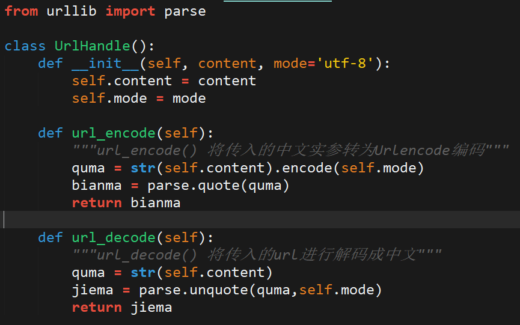

### 为什么需要URL编码

1.URL 只能使用 ASCII 字符集来通过因特网进行发送。也就是说URL只能使用英文字母、阿拉伯数字和某些标点符号，不能使用其他文字和符号。这意味着 如果URL中有汉字，就必须编码后使用。但问题在于，标准的国际组织并没有规定具体的编码方法，而是交给应用程序（浏览器）自己决定。这会导致"URL编码"成为了一个混乱的领域。

2.对于get传参的网页来说，采取的是如下方式 ( **? key = value** )


问题在于，若是传的参数中包含？和=怎么办，就冲突了，所以需要编码以区分

```html
http://www.biquge.tv/modules/article/search.php?searchkey=xxx
```

<!-- more -->

### 如何进行URL编码

Url编码通常也被称为百分号编码（percent-encoding），编码方式非常简单。

使用%百分号加上两位的字符——0123456789ABCDEF——代表一个字节的十六进制形式。

对于ASCII字符，字母a 在ASCII码中对应的字节是0x61，那么Url编码之后得到的就是%61，字母abc， url编码后得到的就是%61%62%63。

对于非ASCII字符，在无BOM编码格式中有UTF-8和GBK两种。

1."中文"使用UTF-8字符集得到的字节为0xE4 0xB8 0xAD 0xE6 0x96 0x87，经过Url编码之后得到"%E4%B8%AD%E6%96%87"。

2.“中文”使用GBK编码得到 %D6%D0%CE%C4。

**注意一定要先进行编码再向服务器提交，这样可以保证只使用了固定的一种编码方式。**


### python中的URL编码与解码

封装成以下库：



编码和解码的调用：


### 小说爬取

爬小说的脚本写的时候没碰到什么别的问题，就是一个编码的问题，之前不了解，所以写了这篇文章码一下。

在用爬虫向网页提交搜索信息（小说名字）的时候：

```html
http://www.biquge.tv/modules/article/search.php?searchkey=%bd%a3%c0%b4
```

需要用到URL编码来提交（因为我爬的那个网站用的是get方式提交信息，并且是GBK编码）

