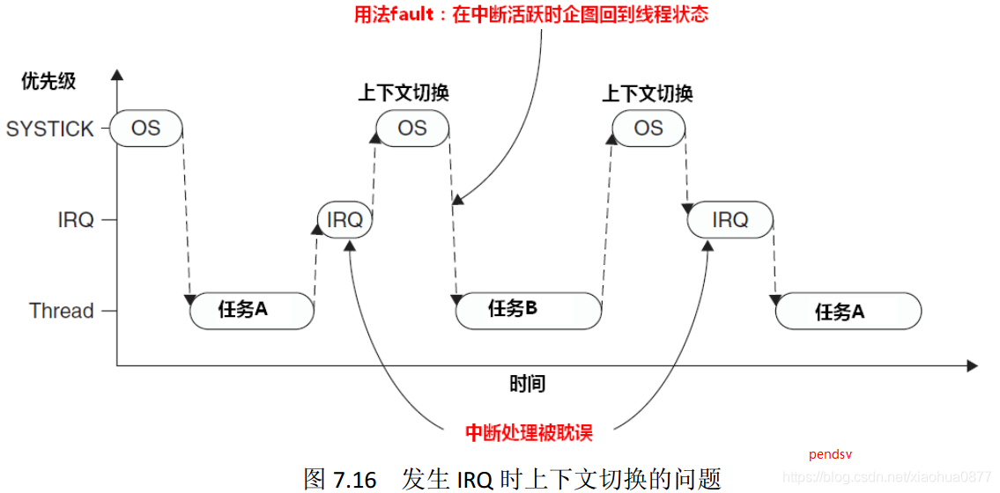
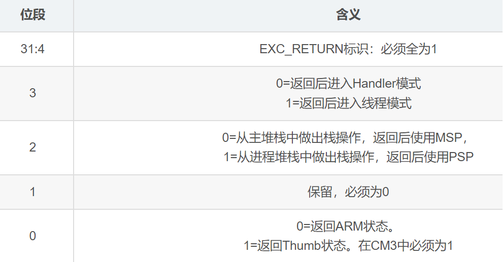

# 底层架构


## STM32硬件支持

Cortex-M3内核提供了以下异常：


编号大于15的均属于外部中断。

异常是可以打断正常执行流的事件，这是实现实时操作系统的关键，本文中将会使用——PendSV**可悬起**异常和SysTick**滴答定时**器。


## SysTick系统滴答定时器

SysTick是一个**24位**的系统节拍定时器，具有自动重载和溢出中断功能，所有基于Cortex_M3处理器的微控制器都可以由这个定时器获得一定的时间间隔。

SysTick在实现本文的实时操作系统中起到了非常关键的作用——节拍 / 时间片，它保证了操作系统运行的基准单位。同时，通过将其优先级设置为最高，就可以实现在一个时间片用完之后，稳定触发该异常，从而实现**时间片的轮转**。

通过以下函数初始化SysTick计数器，设置两次中断之间的时间。

```c
#define TICKS_PER_SEC 1000
SysTick_Config(SystemCoreClock / TICKS_PER_SEC);
```

**重装载值 = SysTick 时钟频率(Hz) x 想要的定时时间（S）**

例如，**SystemCoreClock**为72MHZ，想要实现1ms进一次中断，就只需要将**TICKS_PER_SEC**设置为1000，也就是 x 0.001即可。


## PendSV可悬起异常

基于其可悬起的特点，将其配置为最低优先级，OS就可以利用它“缓期执行”一个异常——直到其它重要的任务完成后才执行动作。

悬起 PendSV 的方法是：手工往 NVIC的 PendSV悬起寄存器中写 1。悬起后，如果优先级不够高，则将缓期等待执行。

PendSV的典型使用场合是在**上下文切换时（在不同任务之间切换）**。

例如，一个系统中有两个就绪的任务，上下文切换被触发的场合可以是：
1、执行一个系统调用
2、**系统滴答定时器（SYSTICK）中断（本文中使用）**

为什么PendSV好用，如下：

假设有这么一个系统，里面有两个就绪的任务，并且通过SysTick异常启动上下文切换。但若在产生 SysTick 异常时正在响应一个中断，则 SysTick异常会抢占其 ISR。在这种情况下，OS是不能执行上下文切换的，否则将使中断请求被打断延迟，而且在真实系统中延迟时间还往往不可预知，这是不应该被允许的。

在Cortex-M3中，如果 OS 在某中断活跃时尝试切入线程模式，将触犯用法fault异常。



PendSV完美解决了这个问题。PendSV异常会自动延迟上下文切换的请求，直到其它的 ISR都完成了处理后才放行。为实现这个机制，需要把 PendSV编程为最低优先级的异常。

如果 OS检测到某 IRQ正在活动并且被 SysTick抢占，它将悬起一个 PendSV异常，以便缓期执行 上下文切换。


上图很好的展示了本文实现的操作系统的任务切换的时序实现。


## 汇编实现

使用SysTick异常实现时间片轮转，并触发PendSV中断。

在PendSV中实现上下文的切换。


### SysTick汇编函数

```assembly
NVIC_INT_CTRL    EQU            0xE000ED04    ; 中断控制寄存器
NVIC_PENDSVSET   EQU            0x10000000    
; Enable PendSV（触发软中断，通过给NVIC_INT_CTRL第28bit写1）
NVIC_SYSPRI14    EQU            0xE000ED22    ; 系统优先级寄存器(14)  对应 PendSV
NVIC_PENDSV_PRI  EQU            0xFF          ; PendSV 中断优先级为最低(0xFF)

CPU_TASK_SCHEDULE                    ;OS context switch（任务切换）
    PUSH    {R4, R5}                
    LDR     R4, =NVIC_INT_CTRL       ; R4 = NVIC_INT_CTRL（触发 PendSV 异常）
    LDR     R5, =NVIC_PENDSVSET      ; R5 = NVIC_PENDSVSET
    ; *R4 = R5（向 NVIC_INT_CTRL 写入NVIC_PENDSVSET 触发 PendSV 中断）
    STR     R5, [R4]                 
    POP     {R4, R5}
    BX      LR                       ; return;
    
    align 4							 ; 4字节对齐，写于文件末
    end
```

其中中断控制寄存器片段


### PendSV汇编函数

```assembly
PendSV_Handler                          ; 保存现场
    CPSID    I                          ; 关中断，任务切换期间要关中断
    ; 异常处理或进程切换时，需要保存程序状态寄存器的值，可用该指令读出程序状态寄存器的值，然后保存。
	MRS     R0, PSP                      
    CBZ     R0, PendSV_Handler_NoSave   ; PSP指针为0就跳转，只在第一次运行时跳转
;----------------------------------------------------------------------------------------
    SUB     R0, R0, #0x20               ; R0 = R0 - 0x20;  
    STM     R0, {R4-R11}				; 将R4-R11的值暂存起来             
;----------------------------------------------------------------------------------    
    LDR     R1, =TCB_CurP               ; LDR伪指令获取 TCB_CurP->StackTop 指针
	; R1 = *R1; 获取 TCB_CurP->StackTop 指向的值（这个值是一个地址）
	LDR     R1, [R1]                    
	; *R1 = R0; 将现场信息（R4-R11）存入 TCB_CurP->StackTop 指向的地址所在的内存
    STR     R0, [R1]                    

; 由于汇编语言是顺序执行，所以执行完上面那条语句后，在没有跳转等指令的情况下，会接下去执行。
PendSV_Handler_NoSave            	    ; 恢复现场
    LDR     R0, =TCB_CurP               ; R0 获取 TCB_CurP->StackTop 指针
    LDR     R1, =TCB_NextP          	; R1 获取 TCB_NextP->StackTop 指针
    LDR     R2, [R1]              		; R2 获取 TCB_NextP->StackTop 指向的值
    STR     R2, [R0]                	; 将 TCB_CurP->StackTop 指向这个值
	; 将 以这个值为地址的内存里的值（也就是之前保存的现场信息）存入R0，开始恢复
    LDR     R0, [R2]                	
    
    LDM     R0, {R4-R11}				; 恢复R4-R11的值到 R0 中
    MSR     PSP, R0                  	; PSP 指向R0（恢复现场）

    ORR     LR, LR, #0x04           	; LR=LR|0x04; EXC_RETURN, 第2位赋1表示返回后使用PSP
    CPSIE     I                     	; 开中断
    BX    LR                        	; return;
```

关于**LR寄存器**，在出入ISR的时候，LR的值将得到重新的诠释，这种特殊的值称为**EXC_RETURN**。

EXC_RETURN的二进制值除了最低4位外全为1，而其最低4位则有另外的含义，如下：



关于**上下文切换**，一个形象的GIF如下所示：


### 中断控制的汇编函数

```assembly
CPU_SR_Save                     ; 关中断（进入临界区）
    MRS     R0, PRIMASK			; 读取 PRIMASK 到 R0,R0 为返回值
   								; PRIMASK寄存器只有一位，当这个位置 1 时 就关掉所有可屏蔽的异常
    CPSID   I					; PRIMASK=1,关中断(NMI和硬件FAULT可以响应)
    BX      LR					; 返回

CPU_SR_Restore			    	;开中断（退出临界区）
    MSR     PRIMASK, R0			;读取 R0 到 PRIMASK 中,R0 为参数
    BX      LR					
```

c语言定义宏实现调用

```c
u32 	 CPU_SR;  				 // 保存PRIMASK的值(中断开关的状态控制)
#define  ENTER_CRITICAL()  {  CPU_SR = CPU_SR_Save();  }   // 关中断
#define  EXIT_CRITICAL()   {  CPU_SR_Restore(CPU_SR); }
```


### 初始化的汇编函数

```assembly
CPU_Start
    CPSID    I          
    
    LDR     R0, =NVIC_SYSPRI14       ; 初始化PendSV，并设置中断优先级为255，最低     
    LDR     R1, =NVIC_PENDSV_PRI          
    STRB    R1, [R0]                      
    
    LDR R4,  =0x0                    ; 初始化PSP为0   
    MSR    PSP, R4                           
    
    LDR    R4, =NVIC_INT_CTRL        ; 先触发一次PendSV异常
    LDR    R5, =NVIC_PENDSVSET       
    STR    R5, [R4]                   

    CPSIE    I  
```


# 系统结构


## 任务控制块TCB

包含三个部分，任务栈顶指针、延时时长以及任务状态

```c
typedef unsigned int  STACK_TypeDef;
typedef unsigned int  PRIO_TypeDef;
typedef unsigned int  TICKS_TypeDef;
typedef void (*TASK_TypeDef)(void);

// 任务状态
typedef enum TASK_STATUS
{
	TASK_READY = 0,				//就绪
	TASK_DELAY = 1,				//延时等待
	TASK_SUSPEND = 2,			//挂起
} TASK_STATUS;

// TCB控制块
typedef struct 
{
	STACK_TypeDef *StackTop;     //任务栈顶指针
	TICKS_TypeDef Delay;         //任务延时时钟
	TASK_STATUS   State;         //任务状态
} TASK_TCB, *TCB_Ptr;
            
#define TASKS_NUM	   5        // 设定运行任务的数量,不包含空闲任务 

extern  TASK_TCB      TCB[TASKS_NUM + 1];   // 定义任务控制块TCB数组
extern  PRIO_TypeDef  PrioCur;		        // 当前任务的优先级
extern  PRIO_TypeDef  PrioNext;             // 下一个运行任务的优先级	
extern  TCB_Ptr       TCB_CurP;             // 当前任务的TCB指针
extern  TCB_Ptr       TCB_NextP;            // 下一个运行任务的TCB指针
```


## 就绪任务列表

```c
extern  u32           TaskReadyTable;       // 就绪任务列表
```

维护一个任务就绪列表，通过对位进行操作来保存就绪的任务。

每个任务都有相对应的、不同的优先级，以此区分任务。

```c
// prio: 任务优先级
#define SetTaskReady(prio)	(	TaskReadyTable |= 0x01<<prio	)	
#define DelTaskReady(Prio)	(	TaskReadyTable &= ~(0x01<<Prio)	)
```

通过一个简单的for循环获取当前最高优先级的任务（实际就是获取优先级数）

```c
u32 i;
for(i = 0; (i < TASKS_NUM) && (!(TaskReadyTable & (0x01<<i))); i++);
```

相应优先级的任务，存于 **TCB[i]** 中。


## 任务的创建

```c
/*
 --- 创建任务                                                                    
 - *p_Task:  任务函数地址
 - *p_Stack：任务栈顶指针
 - prio:     任务优先级
*/
void STM32_TaskCreate(TASK_TypeDef task, STACK_TypeDef *stack, PRIO_TypeDef prio)
{
    STACK_TypeDef  *p_stk;
    p_stk      = stack;                           //加载栈顶指针
    p_stk      = (STACK_TypeDef *)((STACK_TypeDef)(p_stk) & 0xFFFFFFF8u);
    
    *(--p_stk) = (STACK_TypeDef)0x01000000uL;     // xPSR
    *(--p_stk) = (STACK_TypeDef)task;             // PC指针
    // 无意义，只为了--p_stk
    *(--p_stk) = (STACK_TypeDef)0x14141414uL;     // R14 (LR)
    *(--p_stk) = (STACK_TypeDef)0x12121212uL;     // R12
    *(--p_stk) = (STACK_TypeDef)0x03030303uL;     // R3
    *(--p_stk) = (STACK_TypeDef)0x02020202uL;     // R2
    *(--p_stk) = (STACK_TypeDef)0x01010101uL;     // R1
    *(--p_stk) = (STACK_TypeDef)0x00000000u;      // R0
    *(--p_stk) = (STACK_TypeDef)0x11111111uL;     // R11
    *(--p_stk) = (STACK_TypeDef)0x10101010uL;     // R10
    *(--p_stk) = (STACK_TypeDef)0x09090909uL;     // R9
    *(--p_stk) = (STACK_TypeDef)0x08080808uL;     // R8
    *(--p_stk) = (STACK_TypeDef)0x07070707uL;     // R7
    *(--p_stk) = (STACK_TypeDef)0x06060606uL;     // R6
    *(--p_stk) = (STACK_TypeDef)0x05050505uL;     // R5
    *(--p_stk) = (STACK_TypeDef)0x04040404uL;     // R4
    
    TCB[prio].StackTop = p_stk;
    TCB[prio].Delay = 0;
    TCB[prio].State = TASK_READY;
}
```

 

## 部分函数接口

### 任务的创建

