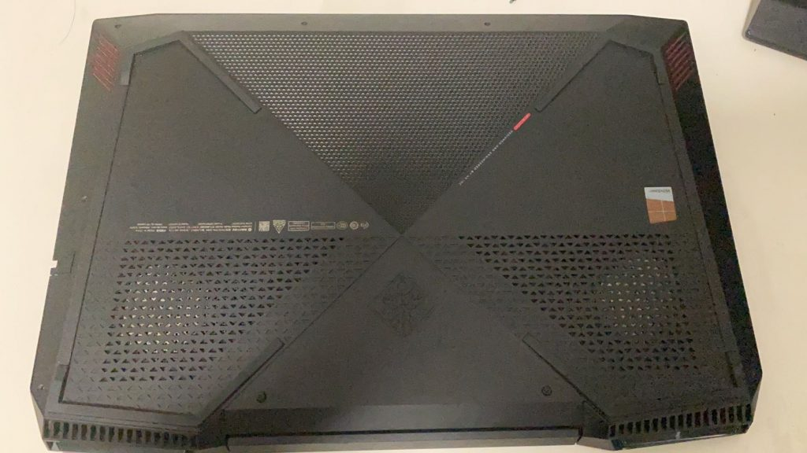
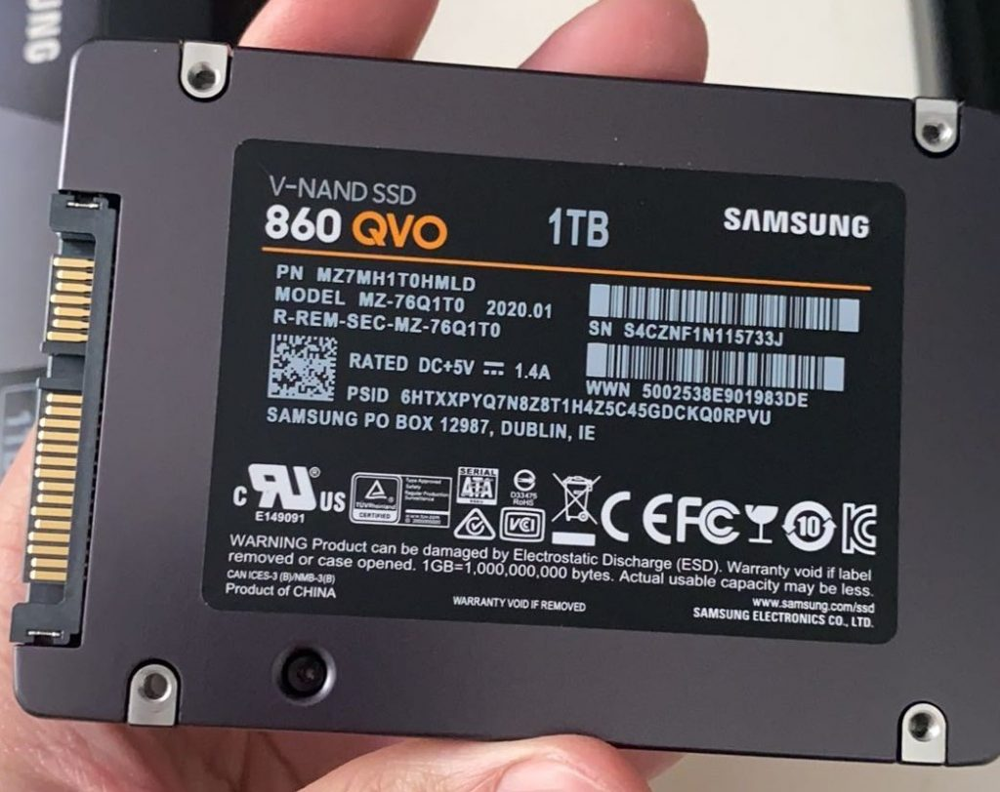

小的时候总觉得电脑是个很神奇很牛掰的东西，虽然后来对电脑的构成还有运行原理等有了一个大致的了解，但依旧玄乎中带一点敬仰（奇怪的用词）。前段时间给母亲大人配了一台台式，自己亲自买了各种组件，组装起来后才发现其实真没什么难度。。基本是熟练度和经验的关系了。不过这倒是让我对电脑组成和运行有了更深刻的认识~

恰巧我的笔记本最近也毛病重重（贼卡），于是在我的一位同学祝大师（sdl，wsl）的帮助下，对电脑运行的CPU占用率、硬盘测速、甜甜圈视频输出、内存延时、模具散热、坏道检测等多项数据进行了测试。发现了唯一的问题在于机械盘坏道有点多（跑了1%就有几十柱坏道，神奇，讲道理坏成这样应该经常会卡死，而我只是运行慢一些。。）

然后开始拆机~清灰，然后取出机械硬盘在台式机进行一些测试。

<!-- more -->

### 拆机简录

首先把四周的螺丝拧开~然后掰开后盖。因为后盖四周带有卡扣固定，所以在掀开的过程中需要拿螺丝刀一点一点的撬开。注意到上图中左右两个网格状的梯形，里面有两坨圆形的灰色，这都是灰，因为这两个网格正对电脑的散热风扇，久而久之在散热过程中就积灰了。

最后掀开，如下：

上图中左右上角是风扇，可以看到积灰很多。风扇上面是散热管，它与风扇之间的缝隙同样是积灰非常严重的地方，需要清理。

中间蓝色是主板，主板上面那块绿色就是内存条，我的是一根8g的（反正也要换硬件，顺便再加个8g内存条？）

右边风扇下面的绿色是固态硬盘（当时配的128g，这次打算换成256g，我c盘就剩12G了，括个容），用作电脑的系统盘存储。

左边风扇下面那块蓝青色板子就是机械硬盘了（配的1T，叠瓦的据说坏的快，在犹豫换1T的机械还是固态，，价格差了五六百，但固态体验要好很多）

机械盘右上角那一小块贴了白色标签的就是无线网卡

右下方那一大块是电池了，图里已经拆了~

拆下之后对积灰的缝隙，风扇的缝隙进行了清理，顿时感觉舒爽了很多hhhh

### 问题测试

取下机械硬盘，接到我家台式机上，在里面下了个300英雄打了一把人机，发现流畅的一批，，惊了

又接回来进入ubuntu系统，跑了一下pycharm，，还是很流畅

大概是系统问题，，，遇事不决重装系统~

### 后续

京东物流是真的快！当晚9点多下单，第二天上午就到了！1TB的SSD硬盘，SATA接口（换机械的），打折799.

然后是数据转移！

把原来的机械盘和新的固态盘都接到我家台式机上，先格式化好新盘，转gpt分区。我用了DiskGenius的磁盘克隆功能，一键复制分区和数据（大概三个小时左右，我1T基本用满了），然后就搞定啦。

剩下的机械盘格式化了塞家里电脑凑合用着，舒服！

把固态塞进笔记本，开机，测试了一下软件启动速度，真香！
