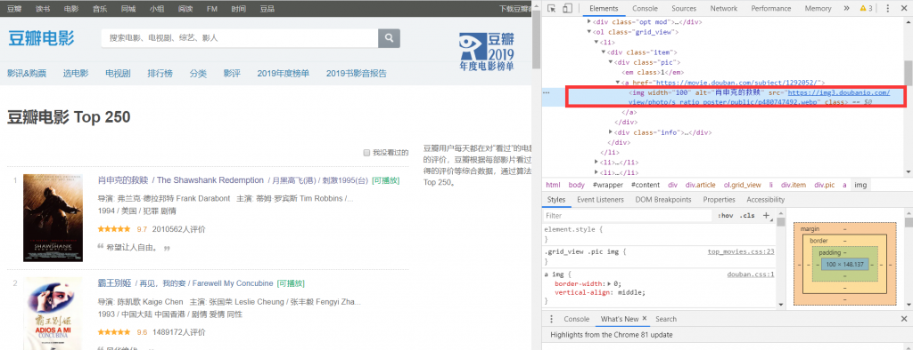
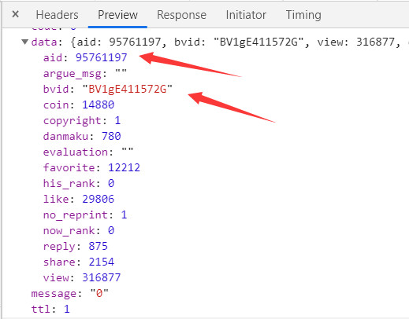

前两天在阿草微博粉丝群水群的时候，看到有朋友说~~馋~~想要一个往期视频的封面，但不知道咋保存~（网上有封面提取的网站）

我一想，应该可以用爬虫去实现嘛，挺有意思的，就尝试着写了一下，链接如下👇

[获取b站视频封面](http://www.hanhan0223.cn/TextProject/BilibiliGetting/bilibili.php)

（现在挂在我的云服务器上，但等到过期了就寄了，GitHub Page并不支持php。话说当初学php就是因为在云服务器上建站用的WordPress，想改别人的主题但是看不懂代码才去学的）

三项功能：

1. 输入视频的网址、BV号获取AV号（AV号明面上已经被b站禁了，但后台实际还在）；
2. 输入视频的网址、BV号、AV号获取视频封面；

3. 输入up主的UID获取该up主所有视频的封面，并打包成zip文件下载。


# 获取封面


## 1.爬取图片的脚本

**如何找到b站视频的相关信息和封面图片的源网址呢？**


### 关于封面图

最开始学爬虫的朋友们应该都爬过豆瓣top250这个经典案例。



在body里找到img属性，里面的src就是图片的原链接了。但是要注意到一点，这里图片源文件的后缀：webp。这是一种有损压缩格式图片，优势在于网络传输快，但爬取视频封面是为了什么！是为了高清图啊！所以不能这么爬。


在个人主页中，可以通过选取工具定位到img标签，发现src里的也是webp格式图片


打开链接图片很糊而且像素低。那么问题来了，哪里有高清的呢！答案就在视频界面里。


不在body中！因为视频界面并没有显示封面图片！而是在head中！找到属性（itemprop）为image的，发现content中的链接，后缀为jpg格式，这就找对了，打开发现确实是高清图


链接位置找到了，剩下的就简单了~就不多说了。


### 关于AV号

之前b站因为av号名称违规（？）改为了BV号，但是av号并没有完全删除，在b站中搜索视频av号同样能获取视频，这说明av号这项数据依旧保存着，那如何找出该数据呢？在b站的数据接口。


打开解析器network选项，可以看到该视频数据接口的url。archive（档案）后面的内容aid同理可以替换成bvid



可以看到该网址返回的是一串json数据，里面包含了av、bv、投币、收藏、点赞、分享、评论、观看数、这些数据，在这里便可以获取到AV号了，在就脚本中解析该json数据然后提取就可以显示在网页中了。

而个人空间同样拥有数据接口保存了该页所有视频的标题、简介、bv等信息，也可以获取下来，不再赘述。


## 2.py脚本与php的数据交互

**py文件如何向php文件传值？ ajax如何获取php文件的传值？php中如何调用py脚本？**

传值其实很简单，，就是打印函数，python 的**print**和php 的**echo**。

调用py脚本，用exec函数：

```php
$c = exec("/usr/bin/python GetBilibiliUpCover.py {$func} {$uid} {$bv}");
```

exec用于执行一个外部程序，主体为执行命令，可以附带参数传递，输出数组和状态返回。因为程序要在服务器里运行，所以输入的就是ubuntu的命令行了，ubuntu怎么运行python脚本就怎么来。

后面的三个是输入参数。在python中通过如下方式获取：

```python
sys.argv[1]
```

argv是一个数组，第一位是模块的名称，这里不去管他，从1开始是按序输入的参数，这里输入了三个，就分别用1、2、3来获取就行。


## 3.前后端数据交互

本半吊子表示根本没系统学过前端知识，所以做这一部分的时候异常痛苦，，界面也丑的一言难尽==

用的ajax，但一开始死都进不去succes步，总进error。。

```javascript
$.ajax({
    type : "GET",
    url : "getting.php",
    data : {
        'func':$("#f1").val(),
        'bv':$("#av_info").val()
    },
    dataType : "text",
    success : function(msg) {
        $("#result").empty();
        document.getElementById("dynamic_av").style.display = "";
        var data = '';
        if (msg != ''){
        	data = eval("("+msg+")");
    	}
    	$("#result_av").html("AV号: " + data.av);
    },
    error: function (msg, textStatus) {
    	console.log(msg);
    }
});
```

后来发现一开始数据类型用的json，网上说必须要非常标准的json数据才能接收到，我也不明白为什么我在py文件里封装的json数据就不行。。。

后来就改成text，文本用eval转化一下提取出来就解决了。


# 获取视频文件


